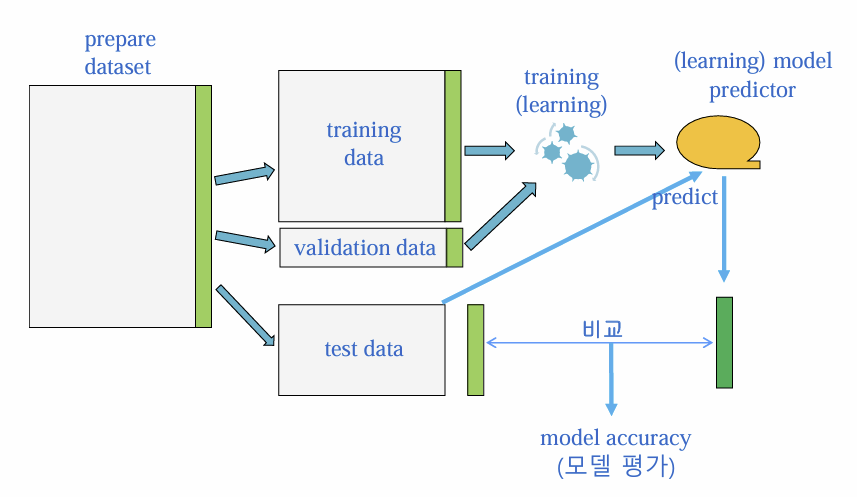

# 1주차

1. 기계 학습의 종류
    
    (1) 지도 학습: 설명변수(x), 반응변수(y) 존재
    
    - 회귀: y가 수치형 ex) 주가, 기온
    - 분류 등.. : y가 범주형 (정상인or환자, 남or여)
    
    (2) 비지도 학습: 설병변수(x)만 존재
    
    - 군집화 ex) 고객 세분화, 비정상거래 탐지
    
    (3) 강화 학습
    
    *딥러닝은 지도학습 방법에 해당된다.
    
2. 학습 자료: 데이터
    1. 반응 변수
    2. 설명 변수

- 반응변수(Y)와 설명변수(X) 간의 관계를 찾는 것을 훈련이라고 한다.

(설명 변수, 반응 변수) — learning, training —> (예측 모델)

1. Learning

: y = f(x)

일반 수학에서는 f()와 x를 알 때 y를 구하는 일을 했지만

머신러닝에서는 x와 y를 알 때 f()를 알아내고자 함

ex) 키, 몸무게 등 정보로부터 고혈압 여부를 예측

1. Learning 방법
    1. 전통적 문제 해결
        
        인간 분석자가 데이터를 연구하여 어떤 원리나 이론을 도출
        
    2. 머신 러닝*
        
        데이터와 학습 방법을 제시하고 프로그램 스스로 원리나 이론을 도출하도록 함
        

Learning의 결과는 (learning) model이다.

- 어떤 방법으로 학습을 시켰는지에 따라 모델의 형태는 다양

머신러닝은

- 과거의 축적된 데이터를 학습하여 미래를 예측하는 기술
- 얼마나 정확한 모델을 만드느냐가 중요하다
- 학습데이터가 많을 수록 유리하다
- 목표: 새로운 설명변수의 값이 주어졌을 때, 정확한 예측값을 주는 모형을 찾는 것!!!! (미래의 자료를 잘 예측할 수 있어야함.)

---

1. 학습 모델 개발 과정
    1. 분류, 회귀

prepare dataset을 세가지로 나눈다

(Training: 50~75%, Test: 10~30%, validation: 나머지)

- Training data

: 과거 데이터의 역할

- Validation data

: 학습(훈련) 과정에서 만들어지는 모델을 평가하는데 사용

- Test data

: 미래 데이터의 역할

미래 데이터는 없으므로 학습에 사용하지 않은 일부 데이터를 미래의 데이터로 간주한다.

→ 미래 예측 시 모델이 어느 정도의 성능을 보일 지 판단하는 자료 

<Training accuracy / Test accuracy>

- Training accuracy

 : 모델이 과거의 데이터를 얼마나 잘 설명할 수 있는 지를 보여줌

- Test accuracy

: 모델이 미래의 데이터를 얼마나 잘 예측할 수 있는 지를 보여줌.

일반적으로Training accuracy > Test accuracy