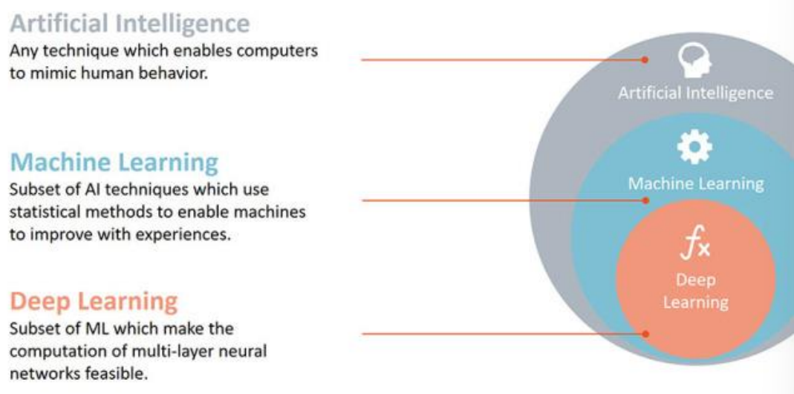

# 1주차 정리 - Machine learning

---

## 1. AI scpoes

## 2. Machine learning

- 과거의 경험을 미래의 결정(예측)에 활용하는 소프트웨어를 디자인하고 연구하는 분야
    
    → 과거 데이터로부터 숨겨진 규칙을 찾아내어 일반화하고, 이를 미래의 예측에 활용
    
    → 인간은 규칙을 알아내는 방법을 제시 /  실제 규칙은 머신이 알아냄 
    
    → 학습: 머신이 규칙을 알아내는 과정 (인간 입장에서는 머신을 훈련시킨다고 함)
    
    → 얼마나 정확한 모델을 만드느냐가 관건, 학습 데이터가 많을 수록 유리
    
- 머신 러닝 훈련

→ 지금까지는 f()와 x를 알 때 y를 구하는 일을 했다면, 머신 러닝에서는 x, y를 알 때 f()를 알아내고자 하는 것

+) y를 레이블, X를 샘플이라고 하기도 함

## 3. Machine learning 분류

- 지도 학습
    
    → 설명 변수(X), 반응 변수(y) 존재
    
    - 회귀
        
        → y가 수치형
        
        → 실수 입력(X)과 실수 출력(y)이 주어질 때, 입력에서 출력으로의 매핑 함수를 학습
        
        → 이후 새로운 입력 값이 들어왔을 때 합리적인 출력 값을 예측
        
    - 분류
        
        → y가 범주형
        
        → 입력을 두 개 이상의 레이블(유형)으로 구분
        
    
    
    
- 비지도 학습
    
    → 설명 변수(X)만 존재
    
    → 컴퓨터가 스스로 입력들을 분류
    
    - 군집화
        
        → 데이터간 거리를 계산하여서 입력을 몇 개의 그룹으로 나누는 방법
        
        
        
- 강화 학습
    
    → 어떤 환경 안에서 정의된 에이전트가 선택 가능한 행동들 중 보상을 최대화하는 행동 혹은 행동 순서를 선택하는 방법
    
- 간단 요약

## 4. 학습 모델 개발 과정

- Classification, regression

- Training data
    
    → 과거 데이터의 역할
    
- Validation data
    
    → 훈련 과정에서 만들어지는 모델을 평가하는데 사용
    
- Test data
    
    → 미래 데이터의 역할
    
    → 미래 예측 시 모델이 어느 정도의 성능을 보일지를 판단하는 자료
    
- Training accuracy vs Test accuracy
    - Training accuracy
        
        → 모델이 과거의 데이터를 얼마나 잘 설명할 수 있는지
        
    - Test accuracy
        
        → 모델이 미래의 데이터를 얼마나 잘 예측할 수 있는지
        
    - 일반적으로 Training accuracy > Test accuracy