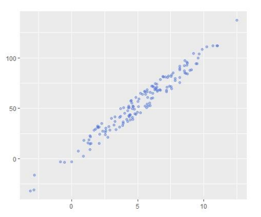

# 2주차 정리 - Regression

---

# 1. Simple linear regression

- 종속 변수와 독립 변수 사이의 선형 관계를 파악하고 이를 예측에 활용하는 방법
- 단순 선형 회귀식:

$$
y = Wx + b
$$




- 상수인 W와 b를 찾는 것이 학습 목표
- 두 변수가 선형 관계에 있는지 알아보는 방법: 산점도, 상관계수
- 예시 코드
    - regression_simple.py
        
        ```python
        # load required modules
        import matplotlib.pyplot as plt
        import numpy as np
        import pandas as pd
        
        from sklearn.linear_model import LinearRegression
        from sklearn.metrics import mean_squared_error, r2_score
        from sklearn.model_selection import train_test_split
        
        # prepare dataset
        cars = pd.read_csv('../데사데이터/cars.csv')
        print(cars)
        speed = cars['speed'].to_frame()
        dist = cars['dist']
        # 이때 speed를 to_frame()하는 이유는
        # train_test_split()을 사용할 때 입력 변수는 일반적으로 DataFrame 형식이 필요하기 때문
        # cars['speed'] 만 한다면 Series 형식으로 저장됨
        
        # Split the data into training/testing sets
        train_X, test_X, train_y, test_y = train_test_split(speed, dist, test_size=0.2, random_state=123)
        
        # Define learning method
        model = LinearRegression()
        
        # Train the model using the training sets
        model.fit(train_X, train_y)
        
        # Make predictions using the testing set
        pred_y = model.predict(test_X)
        print(pred_y)
        
        # prediction test
        print(model.predict([[13]]))
        print(model.predict([[20]]))
        # model.predict([13])는 잘못된 사용
        # Scikit-learn의 predict()는 입력 데이터가 반드시 2D 형태여야 하기 때문
        
        # The coefficients & Itercept
        print('Coefficients: {0:.2f}, Intercept {1:.3f}'.format(model.coef_[0], model.intercept_))
        # Coefficients => W / Intercept => b
        # y = 3.96x - 18.323
        # dist = 3.96 x speed - 18.323
        
        # The mean squared error
        print('Mean squared error: {0:.2f}'.format(mean_squared_error(test_y, pred_y)))
        
        # The coefficient of determination: 1 is perfect prediction
        print('Coefficient of determination: %.2f'% r2_score(test_y, pred_y))
        
        # Plot outputs
        plt.scatter(test_X, test_y, color='black')
        plt.plot(test_X, pred_y, color='blue', linewidth=3)
        
        plt.xlabel('speed')
        plt.ylabel('dist')
        
        plt.show()
        ```
        
        
        

### +) 손실 함수

- 직선과 데이터 사이의 간격을 제곱하여 합한 값을 손실 함수라 함
- 손실 함수 최소화
    - 경사 하강법 (gradient descent method)


- 경사 하강법 구현 코드
    
    ```python
    import numpy as np
    import matplotlib.pyplot as plt
    X = np.array([0.0, 1.0, 2.0])
    y = np.array([3.0, 3.5, 5.5])
    W = 0 # 기울기
    b = 0 # 절편
    lrate = 0.01 # 학습률
    epochs = 1000 # 반복 횟수
    
    n = float(len(X)) # 입력 데이터의 개수
    
    # 경사 하강법
    for i in range(epochs):
    	y_pred = W*X + b # 예측값
    	dW = (2/n) * sum(X * (y_pred-y))
    	db = (2/n) * sum(y_pred-y)
    	W = W - lrate * dW # 기울기 수정
    	b = b - lrate * db # 절편 수정
    	
    # 기울기와 절편을 출력한다.
    print (W, b)
    
    # 예측값을 만든다.
    y_pred = W*X + b
    
    # 입력 데이터를 그래프 상에 찍는다.
    plt.scatter(X, y)
    
    # 예측값은 선그래프로 그린다.
    plt.plot([min(X), max(X)], [min(y_pred), max(y_pred)], color='red')
    plt.show()
    ```
    

# 2. Multiple linear regression

- **독립 변수가 2개 이상**인 경우
    
    ex) 키와 몸무게를 가지고 혈당 수치를 예측 (독립 변수: 키, 몸무게 / 종속 변수: 혈당수치)
    
- 중선형 회귀식의 형태:

$$
y = B_0 + B_1x_1 + ... B_xx_x + e
$$

- 예시 코드
    - regression_multiple.py
        
        ```python
        import pandas as ps
        import pandas as np
        from sklearn.linear_model import LinearRegression
        from sklearn.metrics import mean_squared_error, r2_score
        from sklearn.model_selection import train_test_split
        
        # Load the prestge dataset
        df = ps.read_csv("../데사데이터/prestige.csv")
        print(df)
        df_X = df[['education', 'women', 'prestige']]
        df_y = df['income']
        
        # Split the data into training/testing sets
        train_X, test_X, train_y, test_y = train_test_split(df_X, df_y, test_size=0.2, random_state=123)
        
        # Define learning model
        model = LinearRegression()
        
        # Train the model using the training sets
        model.fit(train_X, train_y)
        
        # Make predictions using the testing set
        pred_y = model.predict(test_X)
        print(pred_y)
        
        # The coefficients & Intercept
        print('Coefficients: {0:.2f},{1:.2f},{2:.2f} Intercept: {3:.3f}'.format( 
            model.coef_[0], model.coef_[1], model.coef_[2], model.intercept_))
        
        # The mean squared error
        print('Mean squared error: {0:.2f}'.format(mean_squared_error(test_y, pred_y)))
        
        # The coefficient of determination: 1 is prefect prediction
        print('Coefficient of determination: %.2f'%r2_score(test_y, pred_y))
        
        # Test single data
        my_test_x = np.array([11.44, 8.13, 54.1]).reshape(1,-1)
        my_pred_y = model.predict(my_test_x)
        print(my_pred_y)
        ```
        

# 3. Logistic regression

- 예측해야 할 **종속 변수가 범주형 데이터**일 때 이를 회귀 방법으로 해결하고자 하는 시도
    
    (일반적인 회귀 문제에서는 종속 변수가 수치 데이터임)
    
    ex) iris 데이터셋에서 4개의 측정 데이터로부터 품종을 예측
    
    +) 범주나 그룹을 예측하는 문제를 **‘분류’** 문제라고 함
    
- 예시 코드
    - logistic regression.py
        
        ```python
        from sklearn import datasets
        from sklearn.linear_model import LogisticRegression
        from sklearn.model_selection import train_test_split
        from sklearn.metrics import accuracy_score
        
        # Load the diabets dataset
        iris_X, iris_y = datasets.load_iris(return_X_y=True)
        print(iris_X.shape)
        
        # Split the data into training/testing sets
        train_X, test_X, train_y, test_y = train_test_split(iris_X, iris_y, test_size=0.3, random_state=1234)
        
        # Define learning model
        model = LogisticRegression()
        
        # Train the model using the training sets
        model.fit(train_X, train_y)
        
        # Make predictions using the testing set
        pred_y = model.predict(test_X)
        print(pred_y)
        
        # model evaluation: accuracy #########
        acc = accuracy_score(test_y, pred_y)
        print('Accuaray: {0:3f}'.format(acc))
        # Accuarcy = 예측과 정답이 일치하는 instance 수 / 전체 test instance 수
        
        ```
        
- 로지스틱 회귀의 경우에는 종속 변수가 숫자여야 하기 때문에 **범주형 데이터를 숫자(0, 1, 2,..)로 변환**한 후 작업을 해야 함 (Scikit-learn에서는 숫자 변환 안해도 됨)
    - 변환 예시 코드
        
        ```python
        from sklearn.preprocessing import LabelEncoder
        import numpy as np
        number = LabelEncoder()
        
        label_str = np.array(['M', 'F', 'M', 'F', 'M'])
        label_num = number.fit_tranaform(label_str).astype('int')
        print(label_str)
        print(label_num)
        
        # 출력 결과
        >>> ['M' 'F' 'M' 'F' 'M']
        >>> [1 0 1 0 1]
        ```
        

# 4. 과잉 적합 vs 과소 적합

### 4.1 과잉 적합 (overfitting)

- 학습하는 데이터에서는 성능이 뛰어나지만 새로운 데이터에 대해서는 성능이 잘 나오지 않는 모델을 생성

### 4.2 과소 적합 (underfitting)

- 학습 데이터에서도 성능이 좋지 않은 경우
- 모델 자체가 적합지 않은 경우