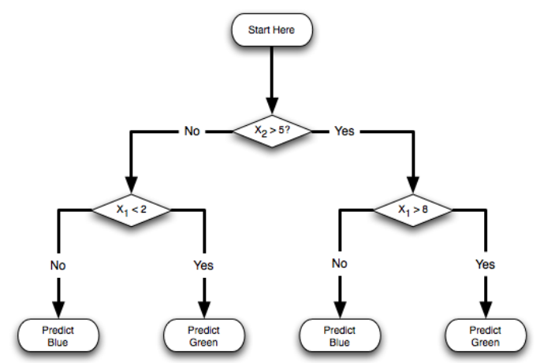

# 3주차 정리 - DT / SVM / RF

---

# 1. Decision tree

### 1.1

- 큰 문제를 작은 문제들의 조각으로 나누어 해결하는 기법
- 의사 결정 또는 예측 결과의 근거가 명확히 제시되어야 하는 경우 많이 이용되는 학습 모델



### **1.2 Issues in decision tree**

1. 트리의 node를 선택할 때 데이터 셋에서 어떤 속성부터 선택할 것인가
2. 트리를 split 할 때 언제 중단할 것인가
    - 트리의 가지를 계속 뻗어 나가면 모든 instance를 100% 식별할 수 있는 tree가 만들어짐
        
        → overfitting 발생
        
        ⇒ 따라서 적당할 때 트리 생성을 중단해야 함 → 가지치기 (pruning)
        
- Decision Tree example
    
    
    
    
    
    Step 1
    
    
    
    Step 2
    
    
    
    
    

### 1.3 장단점

- **장점**
    - 모든 문제에 적합
    - 결측치, 범주형 속성, 수치 속성을 처리하기에 용이
    - 여러 속성 중 중요한 속성들만을 사용하여 예측
    - 매우 많은 수 또는 상대적으로 적은 훈련 데이터로도 모델 구축 가능
    - 수학적 배경이 없이도 해석 가능한 모델
    - 단순한 이론적 근거에 비해 높은 효율성

- **단점**
    - 모델이 쉽게 과대적합 하거나 과소적합화 됨
    - 축에 평행한 구분선을 사용하기 때문에 일부 관계를 모델화 하는데 문제가 있음
    - 훈련 데이터에 대한 약간의 변경이 결정 논리에 큰 변화를 줌
    - 큰 트리는 이해하기 어렵고 직관적이지 않음

# 2. DecisionTreeClassifier

### 2.1 예시 코드

- decision_tree.py
    
    ```python
    from sklearn.tree import DecisionTreeClassifier
    from sklearn.model_selection import train_test_split
    from sklearn.metrics import confusion_matrix
    import pandas as pd
    
    # prepare the liver dataset
    df = pd.read_csv('../데사데이터/chap12/liver.csv')
    print(df.head())
    print(df.columns)
    
    df_X = df.loc[:, df.columns != 'category']
    df_y = df['category']
    
    # Split the dat into training/testing sets
    train_X, test_X, train_y, test_y = train_test_split(df_X, df_y, test_size=0.3, random_state=1234)
    
    # Define learning model (basic)
    model = DecisionTreeClassifier(random_state=1234)
    
    # Train the model using the training sets
    model.fit(train_X, train_y)
    
    # performance evaluation
    print('Train accuracy:', model.score(train_X, train_y))
    print('Test accuracy:', model.score(test_X, test_y))
    # 이때 model.score(pred, test_y) 가 아님에 유의
    # 내부적으로 predict()를 실행해 예측을 수행하도록 설계되어 있어 입력값으로 X와 y를 넣어줘야 함
    
    # Define learning model
    pred_y = model.predict(test_X)
    confusion_matrix(test_y, pred_y)
    
    # Define learning model (tuning)
    model = DecisionTreeClassifier(max_depth=4, random_state=1234)
    
    # Train the model using the training sets
    model.fit(train_X, train_y)
    
    # performance evaluation
    print('Train accuracy:', model.score(train_X, train_y))
    print('Test accuracy:', model.score(test_X, test_y))
    
    # Define learning model (tuning)
    pred_y = model.predict(test_X)
    confusion_matrix(test_y, pred_y)
    
    # visualize decision tree
    from sklearn.tree import plot_tree
    import matplotlib.pyplot as plt
    
    plot_tree(model, fontsize=8, feature_names=df_X.columns.to_list(), class_names=True)
    plt.show()
    
    ```
    
    
    
- +) Confusion Matrix 예시
    
    
    
    - Actual(Positive): 실제 환자
    - Actual(Negative): 실제 환자가 아님
    - Predict(Positive): 실제 환자로 예측
    - Predict(Negative): 환자가 아닌 것으로 예측
    
    ---
    
    - TP(True Positive): 긍정 예측을 성공 → 환자라고 예측해서 실제 환자임을 맞춤
    - TN(True Negative): 부정 예측을 성공 → 비환자라고 예측하여 실제 비환자임을 맞춤
    - FP(False Positive): 긍정 예측을 실패 → 환자라고 예측했지만 비환자임
    - FN(False Negative): 부정 예측을 실패 → 비환자라고 예측했지만 실제 환자임
    
    ---
    
    1. Accuracy (정확도)
        - 전체 예측한 것 중에 올바른 예측을 얼마나 했는지
        
        $$
        \frac{TP + TN } {TP + TN + FP + FN}
        $$
        
    2. Sensitivity (민감도)
        - 실제 Positive를 얼마나 잘 예측했는지
        
        $$
        \frac{TP} {TP + FN}
        $$
        
    3. Precision (정밀도)
        - 긍정으로 예측한 것 중 실제로 맞춘 비율
        
        $$
        \frac{TP} {TP + FP}
        $$
        
    4. Specificity (특이도)
        - 실제 Negative를 얼마나 잘 예측했는지
        
        $$
        \frac{TN } {FP + TN}
        $$
        
    5. F1 Score
        - 불균형 분류 문제에서 평가 척도로 주로 사용
        
        $$
        2 * \frac{Sensitivity * Precision } {Sensitivity + Precision}
        $$
        

### **2.2 Hyper parameters**

- **criterion**
    - String, optional (default = ‘gini)
    - Decision Tree의 가지를 분리할 때 어떤 기준으로 정보 획득량을 계산하고 가지를 분리할 것인지 정함
- **max_depth**
    - int or None, optional (default = None)
    - 최대 깊이 제한
- **min_samples_split**
    - int, float optional (default = 2)
    - 노드에서 가지를 분리할 때 필요한 최소 sample 개수에 대한 제한
- **min_samples_leaf**
    - int, float optional (default = 2)
    - 한 노드에서 가지고 있어야 할 최소 sample 개수에 대한 제한
- **max_features**
    - int, float, string or None, optional (default = None)
    - Decision Tree model을 만들 때 사용할 수 있는 변수의 개수 제한
- **class_weight**
    - dict, list of dict or “balanced” (default = None)
    - 클래스의 불균형이 있는 경우 각 클래스에 다른 가중치를 부여하여 학습할 수 있도록 함

# 3. Support Vector Machine

### 3.1

- 분류 알고리즘 중 하나로 기본적으로 선형 분류 방법을 사용함
- **주요 개념**
    - **최대 마진 초평면 (Maximum-Margin Hyperplane) 찾기**
        
        → 데이터를 가장 잘 구분하는 직선을 찾는 과정
        
    - **커널 기법 사용**
        
        → 데이터를 고차원 공간으로 변환하여 선형적으로 구분할 수 있도록 함
        
- 가설 함수:
    
    $$
    f(x) = sign(w*x+B)
    $$
    
    - w = 학습된 가중치 벡터
    - b = 편향(절편) 값
    - 결과가 +1 이면 한 클래스, -1 이면 다른 클래스로 분류됨
- 최적화 문제
    - 마진을 최대화하면서 손실을 최소화하는 것이 목표
- 서포트 벡터만으로 분류 가능
    
    ⇒ 즉, 모든 데이터를 고려하는 것이 아니라, 경계를 결정하는 데이터(Support Vectors)만을 사용함
    
    
    

### 3.2 예시 코드

- svm.py
    
    ```python
    from sklearn import svm
    from sklearn.model_selection import train_test_split
    from sklearn.metrics import confusion_matrix
    import pandas as pd
    import pydot
    
    # prepare the lever dataset
    df = pd.read_csv('../데사데이터/chap12/liver.csv')
    
    df_X = df.loc[:, df.columns != 'category']
    df_y = df['category']
    
    # Split the data into training/testing sets
    train_X, test_X, train_y, test_y = train_test_split(df_X, df_y, test_size=0.3, random_state=1234)
    
    # Define learning model (basic)
    model = svm.SVC()
    
    # Train the model using the training sets
    model.fit(train_X, train_y)
    
    # performance evaluation
    print('Train accuracy:', model.score(train_X, train_y))
    print('Test accuracy:', model.score(test_X, test_y))
    
    pred_y = model.predict(test_X)
    confusion_matrix(test_y, pred_y)
    
    # Define learning model (poly kernel)
    model = svm.SVC(kernel='poly')
    
    # Train the model using the training sets
    model.fit(train_X, train_y)
    
    # performance evaluation
    print('Train accuracy:', model.score(train_X, train_y))
    print('Test accuracy:', model.score(test_X, test_y))
    
    pred_y = model.predict(test_X)
    confusion_matrix(test_y, pred_y)
    ```
    

### **3.3 Hyper parameters**

- **C**
    - float (default = 1.0)
    - C 값이 클수록 규제를 덜 하여 모델이 더 복잡해지고, C 값이 작을수록 규제가 강해져 단순한 모델이 됨
    - 다시 말하자면 오차 허용 기준. 즉, C 값이 작은 값일수록 오류를 많이 허용함
    
    +) 규제가 강하다 → 모델이 너무 복잡해지는 것을 방지한다 (오류를 덜 허용하는 것이 아님)
    
    - 부가 설명 (ex. C 값이 클 때)
        - C 값이 클수록 → 규제가 약해짐 → 오류를 최소화 → 복잡한 모델 생성
        - 모델이 훈련 데이터에 최대한 맞추려고 함 → 과적합 위험 증가
        - 오차를 거의 허용하지 않으려 하기 때문에 초평면이 복잡해짐
- **kernel**
    - ‘linear’, ‘poly’, ‘rbf’, ‘sigmoid’, ‘precomputed’ (default = ‘rbf’
    - 사용할 커널 유형을 지정
- **degree**
    - int (default = 3)
    - 다항식(poly) 커널에서 사용되는 다항식 차수
    - 다른 커널에서는 무시 됨
- **gamma**
    - {’scale’, ‘auto’} or float (default=’scale’)
    - rbf, poly, sigmoid 커널에서 사용되는 커널 계수


### 3.4 장단점

- **장점**
    - 범주나 수치 데이터 모두에 사용 가능
    - 노이즈 데이터에 영향을 크게 받지 않고 과적합이 잘 일어나지 않음
    - 높은 정확도
- **단점**
    - 최적의 모델을 찾기 위해 커널과 기타 조율모수(hyper parameter)의 여러 조합을 테스트해보아야 함
    - 입력 데이터셋이 feature 수와 데이터 sample 수가 많으면 훈련 시간이 많이 소요될 수 있음
    - 모델의 해석이 불가능하지는 않지만 어려움

# 4. Ensemble

### 4.1

- ‘다수 협의에 의한 결정’ 이라는 원리를 예측 문제 해결에 적용한 것
    
    →  일반적으로 예측 문제에는 하나의 모델을 사용함
    
    만약 여러 개의 모델을 학습 시킨 뒤 예측 결과들을 취합하여 최종 결정을 내린다면 예측 정확도 향상에 도움이 됨
    
    → 결정 트리 기반 모델들에서 많이 사용이 됨
    
    → 앙상블에는 크게 두가지 종류가 있음
    
    - 배깅 (bagging): Random Forest
    - 부스팅 (boosting): AdaBoost, GBM, LightGBM, XGBoost

### 4.2 배깅 (bagging)

- Bootstrap Aggregation 의 약자


### 4.3 부스팅 (boosting)


- 예측 모델의 결과를 보고 오답에 가중치를 부여하여 다음 예측 모델은 오답 부분을 집중적으로 학습하여 오답을 낮추는 과정을 반복
- 부스팅은 배깅에 비해 성능이 더 좋으나 과적합이 더 쉽게 발생하는 것으로 알려짐

# 5. Random Forest

### 5.1

- N개의 Decision Tree가 투표를 통해 결정하는 방식
- **앙상블의 Bagging approach**
- 주어진 데이터에서 랜덤하게 subset을 N번 sampling해서 N개의 예측 모형을 생성
- 개별 예측 모형이 voting하는 방식으로 예측결과를 결정하여 Low Bias는 유지하고 High Variance는 줄이는 방법
    - Bias (편향): 모델이 단순해서 전체적으로 예측이 부정확한 정도
    - Variance (분산): 모델이 훈련 데이터에 너무 맞춰져 있어서 새로운 데이터에 대해 예측이 불안정한 정도
- Regression도 지원

### 5.2 예시 코드

- random_forest.py
    
    ```python
    from sklearn.ensemble import RandomForestClassifier
    from sklearn.model_selection import train_test_split
    from sklearn.metrics import confusion_matrix
    import pandas as pd
    
    # prepare the liver dataset
    df = pd.read_csv('../데사데이터/chap12/liver.csv')
    
    df_X = df.loc[:, df.columns != 'category']
    df_y = df['category']
    
    # Split the data into training/testing sets
    train_X, test_X, train_y, test_y = train_test_split(df_X, df_y, test_size=0.3, random_state=1234)
    
    # Define learning model (# of tree: 10)
    model = RandomForestClassifier(n_estimators=10, random_state=1234)
    
    # Train the model using the training sets
    model.fit(train_X, train_y)
    
    # performance evaluation
    print('Train accuracy:', model.score(train_X, train_y))
    print('Test accuracy:', model.score(test_X, test_y))
    
    pred_y = model.predict(test_X)
    confusion_matrix(test_y, pred_y)
    
    # Define learning model (# of tree: 50)
    model = RandomForestClassifier(n_estimators=50, random_state=1234)
    
    # Train the model using the training sets
    model.fit(train_X, train_y)
    
    # performance evaluation
    print('Train accuracy:', model.score(train_X, train_y))
    print('Test accuracy:', model.score(test_X, test_y))
    
    pred_y = model.predict(test_X)
    confusion_matrix(test_y, pred_y)
    ```
    

### 5.3 Hyper parameters

- **n_estimators**
    - 생성하는 트리의 개수
- **max_featuers**
    - (deafault = ‘auto’)
    - 최적의 분할을 찾을 때 고려할 특징의 개수
- **criterion**
    - (default = ‘gini’_
    - 분할의 품질을 평가하는 방법
- 등등

# 6. XGBoost

### 6.1

- 앙상블의 Boosting 방법
- 최적화된 분산형 Gradient Boosting 라이브러리로 매우 효율적이고 유연함
- 병렬 트리 부스팅 (GBDT. GBM) 기능을 제공하여 많은 데이터 과학 문제를 빠르고 정확하게 해결할 수 있음
- Scikit-learn에서 기본적으로 지원되지 않음

### 6.2 예시 코드

- xgboost.py
    
    ```python
    import xgboost as xgb
    from sklearn.model_selection import train_test_split
    from sklearn.metrics import accuracy_score
    import pandas as pd
    import numpy as np
    
    # prepare the liver dataset
    df = pd.read_csv('../데사데이터/chap12/liver.csv')
    
    df_X = df.loc[:, df.columns != 'category']
    df_y = df['category']
    
    # Split the data into training/testing sets
    train_X, test_X, train_y, test_y = train_test_split(df_X, df_y, test_size=0.3, random_state=1234)
    
    # Convert data into xgboost format
    D_train = xgb.DMatrix(train_X, label=train_y)
    D_test = xgb.DMatrix(test_X, label=test_y)
    
    # Define & train learning model
    param = {
        'eta' : 0.2,
        'max_depth' : 3,
        'objective' : 'binary:logistic',
        'eval_metric' : 'error'
    }
    
    steps = 20 # The number of training iterations
    
    model = xgb.train(param, D_train, steps)
    
    pred = model.predict(D_test)
    round_preds = np.round(pred) # real -> [0,1]
    # XGBoost의 predict() 함수는 확률값(0~1)을 출력하는데
    # 이진 분류에서는 최종적으로 0 또는 1로 변환해야 하기에 round()
    
    accuracy_score(test_y, round_preds)
    ```
    

### 6.3 Hyper parameters

- eta
    - learning rate
- max_depth
    - Tree 깊이 수
- objective
    - 목적 함수 종류
    - 회귀 관련 목적 함수
        - reg:squarederror → default
        - reg:squaredlogerror
    - 분류 관련 목적 함수
        - binary:logistic (이진 분류, 결과가 확률로 나옴) → default
        - multi:softmax (다중 분류)
        - multi-softprob (다중 확률)
- eval_metric
    - 평가 지표
    - rmse - root mean square error
    - mae - mean absolute error
    - logloss - negative log-likelihood
    - error - Binary classification error rate
    - merror - Multiclass classification error rate
    - mlogloss - Multiclass logloss
    - auc - Area under the curve
- seed