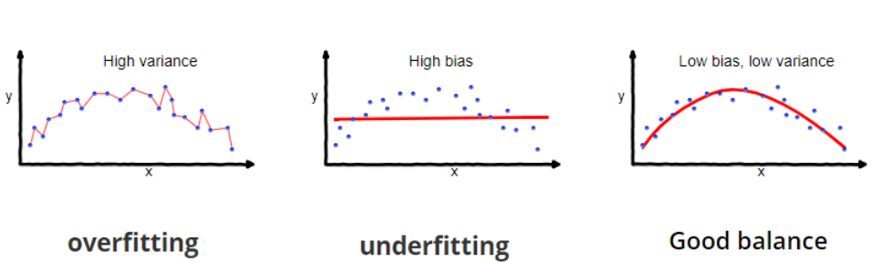

# 4주차 정리 - Cross validation

---

# 1. Bias-Variance trade off

### 1.1 용어 정리

- Classification model error: Noise + Bias + Variance
- Noise: irreducible error
- Bias (편향)
    - 데이터 내에 있는 모든 정보를 고려하지 않음으로 인해 지속적으로 잘못된 것들을 학습하는 경향
    - ex) 코끼리 모양을 학습하는데 다리 부분만 학습
    
    → Underfitting 유발
    
- Variance (분산)
    - 데이터의 너무 세세한 부분까지 학습하여 모델을 만들어 새로운 데이터가 추가되면 모델이 쉽게 바뀜 → 모델 변동성이 커짐
    - ex) 옷 맞추기
    
    → Overfitting 유발
    

### 1.2 Bias-Variance trade off

- Bias를 줄이려고 하면 Variance가 증가하고, Variance를 줄이려고 하면 Bias가 증가하는 현상
- Bias와 Variance가 적절히 균형을 이루는 지점에서 모델을 선택



- ex) Decision Tree
    - 너무 많은 가지 (복잡한 모델): variance 증가
    - 너무 적은 가지 (단순한 모델): bias 증가


- 실제 training에서는 bias 보다는 variance가 커지는 경우 (overfitting)을 더 많이 경험

# 2. K-fold Cross Validation

### 2.1 motivation


- 한번의 분류로 된 데이터 셋은 Test 데이터 셋이 어떻게 구성 되는가에 따라 accuracy가 다르게 나옴

### 2.2 K-fold Cross Validation

- 분류 모델의 미래 데이터에 대한 성능을 보다 정확히 알 수 있는 방법
- 각 K 실험에 대해 K-1 fold를 사용하여 훈련. 테스트 용으로 하나 남아 있음 (일반적으로 k=10을 많이 사용)


K=5

- 모델의 정확도는 각 fold의 정확도들의 평균으로 계산:

$$
Acc = \frac{1}{K} \sum_{i=1}^{K} Acc_i
$$

### 2.3 예시 코드

- svm_kfold.py
    
    ```python
    from sklearn import datasets
    from sklearn import svm
    from sklearn.model_selection import KFold
    from sklearn.metrics import accuracy_score
    import numpy as np
    
    # Load the wine dataset
    wine_X, wine_y = datasets.load_wine(return_X_y=True)
    
    # Define fold
    kf = KFold(n_splits=5, random_state=123, shuffle=True)
    
    # Define learning model
    model = svm.SVC()
    
    acc = np.zeros(5)
    i = 0
    
    for train_index, test_index in kf.split(wine_X):
        print("fold:", i)
    
        train_X, test_X = wine_X[train_index], wine_X[test_index]
        train_y, test_y = wine_y[train_index], wine_y[test_index]
    
        # Train the model using the training sets
        model.fit(train_X, train_y)
    
        # Make predictions using the testing set
        pred_y = model.predict(test_X)
    
        # model evaluation: accuracy
        acc[i] = accuracy_score(test_y, pred_y)
        print('Accuracy: {0:.3f}'.format(acc[i]))
        i += 1
    
    print("5 fold:", acc)
    print("mean accuracy:", np.mean(acc))
    
    >>>
    fold: 0
    Accuracy: 0.500
    fold: 1
    Accuracy: 0.694
    fold: 2
    Accuracy: 0.722
    fold: 3
    Accuracy: 0.686
    fold: 4
    Accuracy: 0.714
    5 fold: [0.5        0.69444444 0.72222222 0.68571429 0.71428571]
    mean accuracy: 0.6633333333333333
    ```
    
- svm_cross_val_score.py
    
    ```python
    from sklearn import datasets
    from sklearn import svm
    from sklearn.model_selection import cross_val_score
    import numpy as np
    
    # Load the wine dataset
    wine_X, wine_y = datasets.load_wine(return_X_y=True)
    
    # Define learning model
    model = svm.SVC()
    
    scores = cross_val_score(model, wine_X, wine_y, cv=5, scoring='accuracy')
    
    print("fold acc", scores)
    print("mean acc", np.mean(scores))
    
    >>> fold acc [0.63888889 0.61111111 0.63888889 0.68571429 0.74285714]
    >>> mean acc 0.6634920634920635
    
    # 여러 개의 평가 척도를 동시에 적용하려면
    from sklearn.model_selection import cross_validate
    
    scores = cross_validate(model, wine_X, wine_y, cv=5, scoring=['accuracy', 'balanced_accuracy'])
    
    print("fold acc", scores)
    print("mean acc", np.mean(scores['test_accuracy']))
    print("mean balanced-acc", np.mean(scores['test_balanced_accuracy']))
    
    >>> fold acc {'fit_time': array([0.00100064, 0.00101423, 0.00091529, 0.00101686, 0.00107646]), 'score_time': array([0.01105046, 0.00198722, 0.00131965, 0.00102353, 0.00103354]), 'test_accuracy': array([0.63888889, 0.61111111, 0.63888889, 0.68571429, 0.74285714]), 'test_balanced_accuracy': array([0.62936508, 0.59206349, 0.63492063, 0.62037037, 0.66666667])}
    >>> mean acc 0.6634920634920635
    >>> mean balanced-acc 0.6286772486772486
    ```
    

### 2.4 K-fold cross validation 의 용도

- **K-fold cross validation이 원하는 모델을 도출하지는 않음**
- 주어진 데이터 셋으로 모델 개발시 ‘미래의 정확도’를 추정
- 최종 모델 개발을 위한 **hyper parameter 튜닝에 사용**
- 전처리시 **feature selection**에 사용

# 3. Hyper parameter tuning

- 대부분의 분류 알고리즘에는 모델 성능에 영향을 미치는 하이퍼 파라미터가 있음
- 하이퍼 파라미터 튜닝은 번거롭고 오랜 시간이 필요함
- Model building process


### 3.1 Greed search cross validation

- GridSearchCV
    - param_grid 매개변수로 지정된 매개변수 값의 그리드에서 후보를 생성함
    - param_grid Example
        
        ```python
        param_grid = [
        	{'C': [1, 10, 100, 1000], 'kernel': ['linear']},
        	{'C': [1, 10, 100, 1000], 'gamma': [0.001, 0.0001], 'kernel': ['rbf']},
        ]
        ```
        
- 예시 코드
    - RF_tunning_grid.py
        
        ```python
        # Random Forest tuning Example
        # using: GridSearchCV
        
        from sklearn.model_selection import GridSearchCV
        from sklearn.ensemble import RandomForestClassifier
        from sklearn.model_selection import train_test_split
        from sklearn.model_selection import cross_val_score
        import pandas as pd
        import pprint
        import numpy as np
        
        pp = pprint.PrettyPrinter(width=80, indent=4)
        # 복잡한 데이터를 깔끔하게 출력하는 도구 
        # 한 줄에 출력할 최대 문자 개수 = 80 / 들여쓰기 간격 = 4
        
        # prepare the credit dataset
        df = pd.read_csv('../데사데이터/PimaIndiansDiabetes.csv')
        print(df.head())
        print(df.columns)
        
        df_X = df.loc[:, df.columns != 'diabetes']
        df_y = df['diabetes']
        
        # base model
        base_model = RandomForestClassifier(random_state=1234)
        scores = cross_val_score(base_model, df_X, df_y, cv=5)
        base_accuracy = np.mean(scores)
        base_accuracy
        
        # GridSearchCV
        # hyper parameter tuning
        param_grid = {
            'bootstrap': [True],
            'max_depth': [80, 90, 100, 110],
            'max_features': [2, 3, 5, 'sqrt'],
            'min_samples_leaf': [3, 4, 5], 
            'min_samples_split': [8, 10, 12],
            'n_estimators': [100, 200, 300, 1000]
        }
        
        # Create a based model
        rf = RandomForestClassifier(random_state=1234)
        
        # Instantiate the grid search model
        grid_search = GridSearchCV(estimator = rf, param_grid=param_grid, cv=5, n_jobs=-1)
        
        # Fit the grid search to the data
        grid_search.fit(df_X, df_y)
        
        # best parameters
        pp.pprint(grid_search.best_params_)
        
        >>>
        {   'bootstrap': True,
            'max_depth': 80,
            'max_features': 3,
            'min_samples_leaf': 4,
            'min_samples_split': 8,
            'n_estimators': 100}
            
        # best model
        best_model = grid_search.best_estimator_
        best_scores = cross_val_score(best_model, df_X, df_y, cv=5)
        best_accuracy = np.mean(best_scores)
        
        print('base acc: {0:0.2f} best acc: {1:0.2f}'.format(base_accuracy, best_accuracy))
        print('Improvement of {:0.2f}%'.format(100*(best_accuracy - base_accuracy)/base_accuracy))
        
        >>> base acc: 0.77 best acc: 0.78
        >>> Improvement of 1.18%
        ```
        
- 하이퍼 파라미터
    - **estimator**
        - Classification algorithm
    - **param_grid**
        - Param grid
    - **cv**
        - 모델 평가시 cross validation 수
    - **n_jobs**
        - 작업에 사용할 processor수
        - -1 은 모든 processor 사용
    - **verbos**
        - Tuning 과정에서 발생하는 메시지 표시 정도
        - 숫자 클수록 상세 정보 표시
        - multi-core가 작동하는 경우는 사용하지 않음

### 3.2 Random search cross validation

- RandomizedSearchCV
    - 가능한 모든 파라미터 조합을 탐색하는 것이 아니라 확률적으로 일부 샘플링하여 탐색
    - 매개변수의 수와 가능한 값에 관계없이 예산을 선택할 수 있음
    - 성능에 영향을 미치지 않는 매개변수를 추가해도 효율성이 저하되지 않음
- 예시 코드
    - RF_tuning_random.py
        
        ```python
        # Randaom Forest tuning Example
        # using: RandomizedSearchCV
        
        from sklearn.model_selection import RandomizedSearchCV
        from sklearn.ensemble import RandomForestClassifier
        from sklearn.model_selection import train_test_split
        from sklearn.model_selection import cross_val_score
        import pandas as pd
        import numpy as np
        import pprint
        
        pp = pprint.PrettyPrinter(width=80, indent=4)
        
        # prepare the credit dataset
        df = pd.read_csv('../데사데이터/PimaIndiansDiabetes.csv')
        print(df.head())
        print(df.columns)
        
        df_X = df.loc[:, df.columns != 'diabetes']
        df_y = df['diabetes']
        
        # base model
        base_model = RandomForestClassifier(random_state=1234)
        scores = cross_val_score(base_model, df_X, df_y, cv=5)
        base_accuracy = np.mean(scores)
        base_accuracy
        
        # RandomizedSearchCV
        
        # define range of parameter values
        # Number of trees in random forest
        n_estimators = [int(x) for x in np.linspace(start=200, stop=2000, num=10)]
        # Number of features to consider at every split
        max_features = [2, 3, 5, 'sqrt']
        # Maximum number of levels in tree
        max_depth = [int(x) for x in np.linspace(10, 110, num = 11)]
        max_depth.append(None)
        # Minimum number of samples required to split a node
        min_samples_split = [2, 5, 10]
        # Minimum number of samples required at each leaf node
        min_samples_leaf = [1, 2, 4]
        # Method of selecting samples for training each tree
        bootstrap = [True, False]
        
        # Create the random grid
        random_grid = {'n_estimators': n_estimators,
                        'max_features': max_features,
                        'max_depth': max_depth,
                        'min_samples_split': min_samples_split,
                        'min_samples_leaf': min_samples_leaf,
                        'bootstrap': bootstrap}
        
        pp.pprint(random_grid)
        
        >>>
        {   'bootstrap': [True, False],
            'max_depth': [10, 20, 30, 40, 50, 60, 70, 80, 90, 100, 110, None],
            'max_features': [2, 3, 5, 'sqrt'],
            'min_samples_leaf': [1, 2, 4],
            'min_samples_split': [2, 5, 10],
            'n_estimators': [200, 400, 600, 800, 1000, 1200, 1400, 1600, 1800, 2000]}
            
        # Use the random grid to search for best hyperparameters
        
        rf = RandomForestClassifier(random_state=1234)
        rf_random = RandomizedSearchCV(estimator = rf,
                                       param_distributions = random_grid,
                                       n_iter = 100, cv = 5,
                                       random_state=42, n_jobs = -1)
        
        # Fit the random search model
        rf_random.fit(df_X, df_y)
        
        # best parameters
        pp.pprint(rf_random.best_params_)
        
        >>>
        {   'bootstrap': True,
            'max_depth': 50,
            'max_features': 'sqrt',
            'min_samples_leaf': 2,
            'min_samples_split': 2,
            'n_estimators': 1000}
            
        # best model
        best_random_model = rf_random.best_estimator_
        best_random_scores = cross_val_score(best_random_model, df_X, df_y, cv=5)
        best_random_accuracy = np.mean(best_random_scores)
        print('base acc: {0:0.2f}. best acc : {1:0.2f}'.format( \
        base_accuracy, best_random_accuracy))
        print('Improvement of {:0.2f}%.'.format( 100 * \
        (best_random_accuracy - base_accuracy) / base_accuracy))
        
        >>> base acc: 0.77. best acc : 0.78
        >>> Improvement of 0.85%.
        ```
        
- 하이퍼 파라미터
    - **estimator**
        - Classification algorithm
    - **param_distributions**
        - Param grid
    - **n_iter**
        - Param combination 에서 선택할 조합의 개수
    - **cv**
        - 모델 평가시 cross validation 수
    - **verbose**
        - Tuning 과정에서 발생하는 메시지 표시 정도
        - 숫자 클수록 상세 정보 표시
    - **random_state**
        - Random seed
    - **n_jobs**
        - 작업에 사용할 processor 수
        - -1 은 모든 processor 사용
    

# 4. Model comparison

- 모든 데이터 셋에는 ‘슈퍼 분류기 (super classification classifier)’ 가 없음
- 가능한 다양한 분류기(predictors, models)를 최대한 많이 테스트해야 함
- Scikit-learn은 모델 비교가 용이하도록 지원함
- 예시 코드
    - model_comparison.py
        
        ```python
        # Model comparison Example
        
        import numpy as np
        import pandas as pd
        import matplotlib.pyplot as plt
        from sklearn.model_selection import cross_val_score
        from sklearn.linear_model import LogisticRegression
        from sklearn.tree import DecisionTreeClassifier
        from sklearn.neighbors import KNeighborsClassifier
        from sklearn.ensemble import RandomForestClassifier
        from sklearn.svm import SVC
        from sklearn.preprocessing import LabelEncoder
        
        # prepare the credit dataset
        df = pd.read_csv("../데사데이터/PimaIndiansDiabetes.csv")
        print(df.head())
        print(df.columns)
        
        df_X = df.loc[:, df.columns != 'diabetes']
        df_y = df['diabetes']
        
        # change string label to integer for Logistic regression
        encoder = LabelEncoder()
        encoder.fit(df_y)
        df_y = encoder.transform(df_y)
        
        # prepare models
        models = []
        models.append(('LR', LogisticRegression(max_iter=500)))
        models.append(('KNN', KNeighborsClassifier()))
        models.append(('DT', DecisionTreeClassifier()))
        models.append(('RF', RandomForestClassifier()))
        models.append(('SVM', SVC()))
        
        # evaluate each model in turn
        results = []
        names = []
        scoring = 'accuracy'
        for name, model in models:
            cv_results = cross_val_score(model, df_X, df_y, cv=10, scoring=scoring)
            results.append(cv_results)
            names.append(name)
            msg = "%s: %f (%f)" % (name, cv_results.mean(), cv_results.std())
            print(msg)
            
        >>>
        LR: 0.773479 (0.035748)
        KNN: 0.721377 (0.044168)
        DT: 0.718694 (0.072436)
        RF: 0.763004 (0.056704)
        SVM: 0.757861 (0.030485)
        
        # average accuracy of classifier
        for i in range(0, len(results)):
            print(names[i] + "\t" + str(round(np.mean(results[i]), 4)))
        
        # boxplot algorithm comparison
        fig = plt.figure()
        fig.suptitle('Algorithm Comparison')
        ax = fig.add_subplot(111)
        plt.boxplot(results)
        ax.set_xticklabels(names)
        plt.show()
        
        ```
        
        
        
    

# 5. Performance metric

- Performance evaluation of learning model (classification)
- For binary classification model only
    - Sensitivity (recall)
    - Specificity
    - precision
    - F1 score
    - ROC, AUC
- For all classification model
    - Accuracy

### 5.1 Binary Classification


- **TP**: True Positive
- **FP**: False Positive
- **FN**: False Negative
- **TN**: True Negative

---

1. **Accuracy (정확도)**
    - 전체 예측한 것 중에 올바른 예측을 얼마나 했는지
    
    $$
    \frac{TP + TN } {TP + TN + FP + FN}
    $$
    
2. **Sensitivity (민감도) 또는 Recall (재현율)**
    - 실제 Positive를 얼마나 잘 예측했는지
    
    $$
    \frac{TP} {TP + FN}
    $$
    
3. **Precision (정밀도)**
    - 긍정으로 예측한 것 중 실제로 맞춘 비율
    
    $$
    \frac{TP} {TP + FP}
    $$
    
4. **Specificity (특이도)**
    - 실제 Negative를 얼마나 잘 예측했는지
    
    $$
    \frac{TN } {FP + TN}
    $$
    
5. **F1 Score**
    - 불균형 분류 문제에서 평가 척도로 주로 사용

$$
2 * \frac{Recall * Precision } {Recall + Precision}
$$

---

- 예시
    - 환자 (Positive), 정상인 (Negative)
    - Sensitivity: 환자를 환자라고 예측한 비율
    - Specificity: 정상인을 정상인이라고 예측한 비율
    - Precision: 환자라고 예측한 것 중에서 실제 환자의 비율
    
    **⇒ 어떤 평가 기준이라도 값이 클수록 좋음!**
    

---

- **roc-auc**


- Accuracy는 imbalace dataset에 대해 올바르게 평가하지 못함
- AUC는 imbalance의 정도에 자유로움

- ROC curve 간단 해석
    - 자세한 설명 필요시: [https://nittaku.tistory.com/297](https://nittaku.tistory.com/297)
    
    
    
    - 아래 면적을 구해서 더 큰 것이 좋은 커브가 되므로 빨간색 커브가 더 좋다
    - ROC curve 아래 면적을 AUC (Area Under the Curve) 라고 함
    - ROC curve를 쓰는 이유는?
        - 클래스별 분포가 다를 때, Accuracy의 단점을 보완하면서 더 자세히 보기 위해서