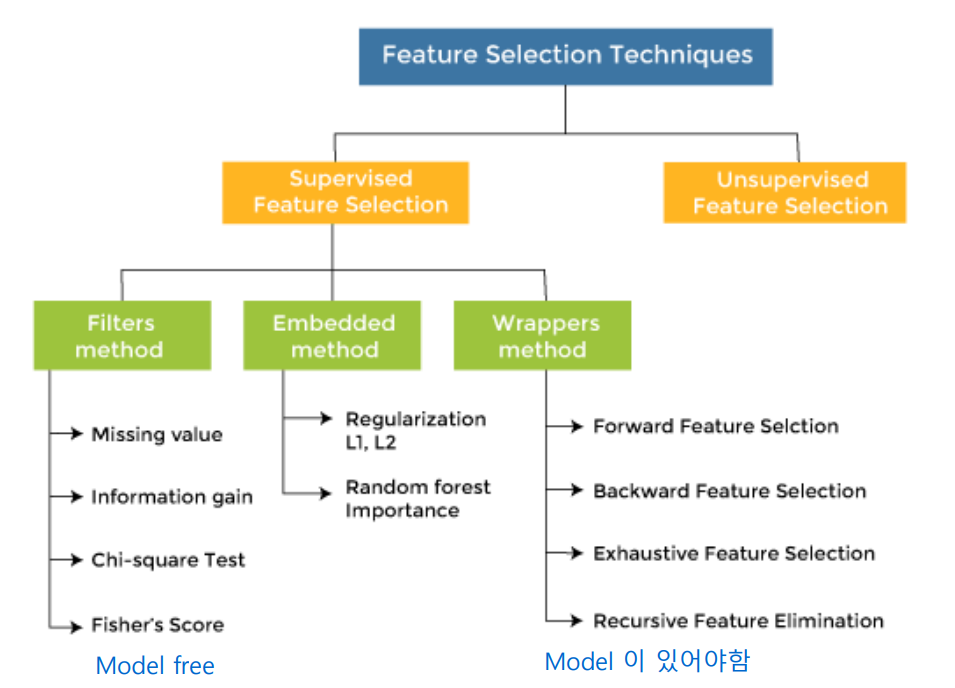

# 5주차 정리 - FS_stacking

---

# 1. Feature selection

- Feature = variable = column in datasets
- 피처가 많을 경우 좋은 피처만 골라내는 것이 필요함

### 1.1 Feature selection

- 자동 또는 수동으로 선택하는 프로세스
- 특징을 평가하고 좋은 특징 하위 집합을 선택
- 좋은 피처는 **분명한 클래스 경계**가 있음
- Feature importance - feature power + **interaction power**

- Filter method
    - 각 피처를 평가하고 최고의 n개 피처를 선택
    - 쉽고 빠름
    - Problem: 피처의 상호작용을 고려하지 않음
- Feature subset selection
    - Forward selection
        
        
        
        - 아무런 피처도 포함되지 않은 모델에서 시작
        - 가장 중요한 피처부터 하나씩 추가하면서 모델을 구성
        - 추가된 특성이 모델 성능을 충분히 향상시키지 않는다면 추가를 멈춤
    - Backward elimination
        
        
        
        - 모든 특성을 포함한 완전한 모델에서 시작
        - 기여도가 가장 낮은 특성부터 하나씩 제거
        - 제거 후 모델 성능이 크게 떨어지면 제거를 멈춤
- Scikit-learn
    - sklearn.feauture_selection 모듈의 클래스는 샘플 세트에서 피처 선택/차원 축소에 사용할 수 있음
        
        이는 추정치의 정확도 점수를 향상시키거나 매우 고차원적인 데이터 셋에서 성능을 향상 시킬 수 있음
        

# 2. Voting Classifier

### 2.1 Simple voting

- 여러 종류의 예측 알고리즘을 이용하여 모델을 만든 뒤 각 모델의 예측 결과로 투표 또는 평균을 구함
- Voting이 항상 좋은 결과를 보여주지는 않음
- Simple voting은 각 모델의 성능을 최대한 끌어올린 뒤 시도

# 3. Bagging meta-estimator

- 동일한 데이터 셋에 대해 sampling을 하여 다수의 데이터 셋을 구성한 뒤 단일 알고리즘으로 모델 생성
- 각 모델의 결과를 종합하여 최종 의사 결정 (예측)

# 4. Model stacking

- 앙상블 방법 중의 하나로 stacked generalization 이라고도 함
- 여러 모델의 예측값을 input으로 해서 새로운 모델로 학습
- 과적합 방지를 위해 사용되기도 함

### 4.1 모델 스태킹 절차

- Level 0: training dataset을 이용하여 sub-model 예측 결과를 생성
- Level 1: level 0의 output 결과가 level 1의 input 값이 되고, level 0의 ouput을 training data로 사용하여 meta learner 모델을 생성

+) level 0 모델들은 되도록 다양한 예측 결과를 input 값으로 활용할 수 있도록 **각기 다른 알고리즘을 사용하는 것이 좋음**

- 각 sub-model의 결과를 결합하는 meta learner 모델은 simple linear model을 사용하는 것이 일반적

+) Level 0 출력 값 처리

- regression의 경우 출력 값 그대로 input 값으로 사용
- classification의 경우 출력 값을 label probabilities 사용하는 것이 더 효과적

### 4.2 StackingClassifier()

- 주요 매개 변수
    - **estimators**
        - Level 0 에 사용할 predictor들
    - **final_estimator**
        - Level 1 에 사용할 predictor
        - default = LogisticRegression
    - cv
        - cross validation 값
        - 미지정시 5-fold cross validation 적용
    - **stack_method**
        - ‘auto’: 아래의 방법 중 하나를 적용
        - ‘predict_proba’: Level 0의 Label probability를 input으로 사용
        - ‘decision_funtion’: Level 0의 출력을 처리하는 함수 적용
        - ‘predict’: Level 0 출력을 그대로 input으로 사용
    - **n_jobs**
        - multi-processing
        - -1: 모든 core 사용
    - **passthrough**
        - False: Level 0의 출력만 Level 1의 학습 데이터로 사용
        - True: Level 0의 출력 + original dataset이 Level 1의 학습 데이터로 사용
        

# 5. 정리

- Practical model development process

