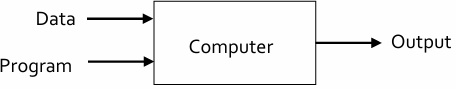

# 1주차

*Ref. LG AI Module 2 강의 및 강의 자료*

## **Introduction to ML**

### 용어

- **기계학습**
    - 알고리즘을 설계하고 개발하는 인공지능의 한 분야
    - Data로부터 스스로 개선되는 알고리즘을 다루는 학문
    
- **인공지능** : 사람과 같은 지능을 만들겠다는 분야
    - 기계학습 뿐 아니라 컴퓨터 비전, 자연어 처리, Robotics 등 수많은 분야 포함
    
- **딥러닝 Deep Learning**
    - 기계학습 중에 Layer(계층)가 많은 신경망을 쓰는 특별한 분야
    - 특정 모델을 사용하는 기계학습의 한 분야

---

### 역사적 관점에서의 기계학습 정의

- **Herbert Simon의 정의**
    - 경험을 통해서 성능을 높이는 시스템에 의한 모든 프로세스를 학습이라 정의
    
- **Arthur Samuel의 정의**
    - game tree에서 alpha-beta pruning 방식 개발
    - 직접적으로 프로그래밍 하지 않고 컴퓨터가 스스로 배울 수 있는 능력을 다루는 학문

기계학습이 학문적으로 정립된 후 

- **Tom Mitchell의 정의**
    - 기계학습이란 컴퓨터 프로그램을 다루는 것
    - 컴퓨터 프로그램은 T,P,E로 정의할 수 있으며 이 세 가지가 완벽하게 정의되어 있어야 함
        
        
        |  | Task | Performance measure | Experience |
        | --- | --- | --- | --- |
        | 의미 | 기계학습으로 
        어떤 작업을 할 것인지 | 성능지표 정의 → 어떤 것이 더 좋은 알고리즘인지 성능지표대로 평가 | 기계학습의 중요한 요소인 Data |
        | 예 |  체스를 두는 것 | 상대방을 많이 이길수록 좋음 
        → 승률을 P로 정의 | 체스를 여러 번 둔 
        한 판 한 판의 경험 |
    - 정리 : 어떠한 작업(T)에 대해 경험(E)을 기반으로 해서 성능(P)를 개선하는 것
    

---

### 기계학습과 전통적인 프로그램 비교

- **전통적인 프로그램**
    
    
    
- **기계학습**
    
    
    

- 예시) spell checker
    
    
    | 전통적인 방식 | 기계학습 방식 |
    | --- | --- |
    | 수많은 경우, 룰, 예외사항 존재 | input, output 쌍을 모아서 학습 data로 제공 |
    | 복잡도가 매우 커지게 됨 | 학습된 프로그램 혹은 알고리즘 사용 |

---

### 기계학습의 목표 : 일반화 Generalization

- training data로부터 특정 패턴을 학습해 새로운 data에 대해서도 작용
- 알고리즘이 잘 정의되었다면, 학습 data가 어떻게 생겼는지 생성또한 가능 → 생성형 generative 인공지능
- **예시**
    - 어린 아이가 수많은 나무를 보고 나무들 사이의 유사성 판단 → 하나의 prototype (전형)을 만듦
    - 부모가 가르쳐주는 것이 아닌 아이가 자라며 스스로 학습하게 되는 것
    - 처음 보는 종류의 나무를 보더라도 스스로 내린 prototype에 의해 해당 식물이 나무라는 것을 판단 가능
    
    ⇒ 수많은 예제를 보고 예제들의 공통적인 특징을 파악해서 일종의 일반화된 개념이나 주장으로 추상화하는 것
    

---

### No Free Lunch Theorem for ML

- 새로운 task, data를 모을 때마다 최적의 알고리즘을 찾는 과정을 수행해야 함
- 하나의 알고리즘이라 하더라도 복잡도가 문제에 따라 달라지기 때문에 모든 경우에 좋을 수 없다
    
    

---

### 기계학습의 여러가지 종류

- **Supervised learning** (감독/지도학습)
    
    
    
    - 기계학습 알고리즘에게 input에 대한 output 쌍을 명시적으로 가르쳐 주는 것
    - Classification(y가 범주형)
    - Regression(y가 실수)
    - x : 많은 경우에 여러 dimension의 vector를 이룸
        
        
        

- **Unsupervised learning** (비감독/비지도학습)
    
    
    
    - 학습 데이터가 x, 즉 input data로만 구성되어 있음
    - data 상에서 outlier나 anomaly들을 찾아내는 과정, 분포를 찾아내는 작업에 사용

- **Semi-supervised learning**
    
    
    
    - 학습 data의 일부는 x,y 쌍으로, 일부는 x만 주는 것 → 일부 데이터에만 labeling한 채로 주어지는 것
    - LU learning : 모든 class에 대해서 일부의 data만 label 제공
    - PU learning : 특정 class에 대한 label만 주어지고 이외의 class에 대해서는 label이 주어지지 않음
    - label이 되지 않은 data에 확률적으로 label을 줄 수 있음 → decision boundary를 보다 정확하게 예측 가능 → classification 성능을 높일 수 있음

- **Reinforcement learning** (강화학습)
    
    
    
    - dataset이 주어지는 대신 주어진 환경과 interaction하며 디테일을 스스로 학습하는 과정
    - supervisor가 따로 존재하는 것이 아닌, 환경의 state를 보고 agent가 action을 선택하게 됨
    - action을 취했을 때 이것이 얼마나 좋은 action이었는지 환경이 평가를 해서 reward를 줌
    - 예시 : 바둑 한 판이라는 환경을 봤을 때 action은 바둑알을 두는 것이 될 것이고, 최종적으로 이겼다면 reward가 크고 졌다면 reward가 작음
    - reward는 바로 주어질 수도 있고, 이후에 주어질 수도 있기 때문에 action을 각각 평가하는 것이 상대적으로 어려움 → 학습에 걸리는 시간이나 난이도가 훨씬 높음