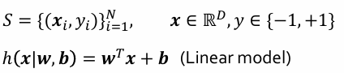

# 2주차 (1)

*Ref. LG AI Module 2 강의 및 강의 자료*

## **Bias and Variance**

### Formal Definitions of ML

- **학습 data**
    - input : x, disired output: y
    - x와 y의 쌍 n개
    
- model class를 정의하면 model class 내에 parameter가 존재
→  parameter를 training data에 대해서 동작하도록 결정하게 됨

- **잘 동작한다는 것**은 무슨 의미인가?
    
    
    
    - 손실함수 Loss Function : model의 예측값과 정답값이 클수록 큰 값을 내는 것
    - Loss를 최소화하는 w와 b의 값을 찾아야 함

---

### 기계학습에서의 일반화

- **기계학습 알고리즘의 능력**
    - 학습된 data보다 학습과정에서 보지 못한 새로운 data에 대해서 잘하는 것이 중요

- **Overfitting** 과적합
    
    
    
    - 세세한 up down까지 fitting되게 설계 → 함수적 표현 매우 복잡, 보지 못한 data에 대한 up down이 심해짐(=training error가 큼)
    - 사소한 up down을 맞추지 않고 전체적인 패턴 파악 → fitting된 함수가 상대적으로 간단, 보지못한 영역에 대해서도 부드럽게 변화
    - 일반화 능력이 떨어지기 때문에 많은 경우에 그림의 오른쪽 model을 선호 (정확도보다 new unseen data에 대한 일반화 능력을 높이기 위해)

---

### 학습 데이터와 테스트 데이터를 얻는 과정

- 개고양이 이미지 classification을 한다고 가정
    
    
    
    - universal set : 세상의 모든 개,고양이를 모든 조건에 대해 관측하는 건 불가능하므로 unobserved
    - training set : universa set에서 sampling된 데이터 (ex. 개 사진 1,000장과 고양이 사진 1,000장)
    - test set : universal set에서 sampling 된 것이지만 training set과 overlap 존재x (학습과정에서 관측 불가, 평가할 때만 볼 수 있음)

---

### 일반화 Error

- **True distribution**
    - data x와 label y와의 모든 상관관계를 다 표현하고 있는 분포
    - 관측 불가능
    - training set, test set은 true distribution에서 sampling
    - true distribution으로부터 n개의 data를 sampling하고 그것이 학습 데이터 S로 주어진 상황
    
- **IID** (Independent and Identically Distribution)
    - training, test set을 만들 때의 가정
    - independent : 모든 data를 획득하는 가정이 독립이다 → 앞의 sampling이 뒤에 영향을 주지 않는다
    - sampling하는 과정에서 분포가 바뀌지 않는다 = stationary하다
    
- **Generalization Error**
    
    
    
    - x와 y가 true distribution을 따른다고 했을 때 그때 구한 Loss의 평균값, 기댓값
    - Loss는 확률 분포를 따름
    
- **Overfitting** 과적합
    - Training error < Generalization error
    - 너무 과하게 학습 data에 적합이 됐다
    
- **Underfitting** 과소적합
    - Training error > Generalization error
    - 정답이 주어져있는 training error를 낮추는 게 generalization error를 낮추는 것보다 훨씬 쉽기 때문에 underfitting이 났다는 것은 model을 잘못 선택했다거나 학습을 제대로 못했다거나 큰 문제가 있는 것
    
- **ML 알고리즘을 잘 학습하기 위해**
    - 1차 목표 : overfitting을 내는 것 = 학습 data에 대해 잘 되는 model은 찾았다는 것 → training error를 최대한 줄여보기
    - 2차 목표 : training error를 조금 손해보더라도 validation 혹은 test error를 낮춰서 과도한 overfitting을 방지한다

---

### Model의 용량, 능력

- 7개의 data를 fit하기 위해 선형함수, 2차함수, 9차 함수를 사용했을 때의 예시
    
    
    
    기본적으로 data에 굴곡 존재
    
    - 선형함수 : 굴곡을 표현할 수 있는 능력, 용량 자체가 없음 → 굴곡 있는 data가 주어졌을 때 underfitting
    - 필요 이상으로 복잡한 model 사용 : training error는 줄일 수 있지만 data가 없는 구간의 굴곡이 심해짐
    - 적절한 차수의 model 사용 : data가 없는 구간의 굴곡이 smooth하게 변함
    
- **Occam’s Razor** (오컴의 면도날 법칙, 경험칙)
    - 현상을 설명할 수 있는 model이 두 세 개 있을 때는 가장 간단한 설명이 맞을 확률이 높다
    - 정답에 대한 법칙이 아닌 경험에 대한 법칙
    - 예 : 사진과 같이 나무가 있고 뒤에 박스가 있을 때, 박스가 하나일지 두개일지? 
    → 확률적으로 더 간단한 설명, 박스가 하나인 경우가 맞을 확률이 높다
        
        
        

- **Model의 Capacity와 Error 사이의 일반적인 관계**
    
    
    
    - capacity를 높이면 높일수록 training error는 줄어든다
    - 일반화 error를 최소화시키는 것이 목표
    - generalization은 측정이 불가능하고 validation error로 예측할 수밖에 없기 때문에 최적의 지점을 찾는 것은 어려움

---

### Regularization 정규화

- 특정 Solution에 대한 preference
- 목적함수 : 학습 데이터에 대해 Loss Function을 정의해서 Loss가 minimize되도록 정의
    
    
    
    - 최적화 문제를 풀기 위해 주어짐
    - 학습 Loss만 사용하면 과적합에 빠질 수 있기 때문에 Regularization term 추가
    - model의 capacity가 증가할수록 값이 커지는 regularization term을 씀으로써 loss만 minimize하는 것이 아닌 model의 capacity도 minimize하도록 목적함수 구성
    
- Parameter
    - parameter : 학습을 통해서 배우는 변수들
    - hyperparameter : 줘야 하는 parameter
        - lambda : 목적함수가 두 가지 component로 되어있기 때문에 얘네들의 상대 중요성을 주는 것
    - hyperparameter와 tuning parameter는 교차검증을 통해 결정하게 됨
    
- 일반화 에러를 낮추는 것이 목적 (training error를 낮추겠다는 것이 아님)
    - 9차수 model을 쓴다고 하더라도 람다를 크게 주어 Regularization을 강하게 준다면 배워지는 함수가 linear 함수가 되고, 람다를 적절히 주면 모든 data에 대해서 fitting이 적절히 되면서 smooth하게 변하는 함수를 배우게 될 것
    - 최적의 capacity model을 찾는 것도 방법이고, 최적의 capacity보다 더 높은 capacity를 가진 model을 활용하는 대신 regularization을 쓸 수도 있다.

---

### Bias/Variance

- 과녁 예제로 이해해보기
    
    
    
    |  | Low Variance | High Variance |
    | --- | --- | --- |
    | Low Bias | 안정적이고 영점도 맞는 경우 | 영점은 맞았으나 쏠 때마다 널뛰는 경우 |
    | High Bias | 안정적으로 쏘나 영점이 안 맞은 경우 | 영점도 안 맞고 쏠 때마다 널뛰는 경우 |
    - bias : 예측값에 대한 평균값과 true 값과의 차이
    - variance :  여러 번 쐈을 때의 평균을 구하고 거리들에 대한 제곱의 평균을 구한 것

- **bias와 variance 간의 Trade-off**
    - test error : bias + variance
    - 어떤 model이 bias가 낮으면 variance가 올라가고 variance를 낮추면 bias가 올라감
    - 둘다 낮추려면 ensemble learning 사용

---

### Overfitting vs Underfitting

- **Overfitting**
    - model이 unstable하고, variance도 올라간다
    - 모델의 복잡도, capacity가 올라갈수록 variance도 올라간다
    - variance를 낮추기 위해선 학습 data를 많이 모으는 것이 가장 중요함. regularization을 쓰는 이유는 data가 충분하지 않아서 preference를 주기 위해 쓰는 것
    
- **Underfitting**
    - high bias라는 것은 underfitting이 났다는 것
    - 모델의 복잡도가 낮다, 데이터가 필요로하는 복잡도보다 낮다는 의미 → 정확도가 떨어지는 모델이다
    - bias를 잡으려면 model의 complexity를 높이는 것이 중요함
    - bias는 data set을 모으는 것이 도움이 되지 않음 (data를 표현할 수 있는 능력이 되지 않기 때문)