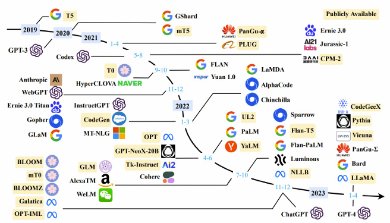

# 2주차 (2)

*Ref. LG AI Module 2 강의 및 강의 자료*

## **Recent Progress of Large Language Models**

### GPT-3

- Generative Pre-trained Transformer의 약자
    - General Purpose Algorithm으로 일반 인공지능을 다루겠다는 것
    - 언어 이해와 생성에 관련된 어떤 질문을 하더라도 응답을 내는 알고리즘
    
- 알고리즘을 굳이 바꾸지 말고 크게 만들자는 Approach가 성행하던 시절
    - 새로운 알고리즘을 만들어 성능을 향상시키는 것보다는 간단한 Model을 몇 개 더 이어붙이면 고심해서 만든 알고리즘의 성능을 뛰어을 수 있기 때문
    
- Open AI사에서 GPT3가 차지하는 비율이 매우 큼
    - GPT3를 기점으로 그 전의 연구결과는 Open Source로 공개 (gpt3부터는 source code 비공개)
    - 상업적인 배타적 사용권을 마이크로소프트에게 줌

---

### InstructGPT (GPT3.5)

- 현실적으로 쓰는 데 있어서 중요한 Model
    - GPT3는 언어이해는 잘 했지만, 이는 사용자가 준 지시를 잘 따르는 것과는 다른 문제
    - GPT3를 가져다가 사람의 지시에 따라 유용하고 안전한 응답을 생성할 수 있도록 생성됨
    
- **RLHF** (Reinforcement Learning from Human Feedback)
    - GPT3를 InstructGPT로 바꾼 핵심 기술
    - 사람의 피드백으로부터 강화학습을 함
    - 처음에는 이러한 지시가 들어오면 이러한 응답을 해야한다는 Label을 통해 감독학습
    - 어느정도 응답을 하는 수준이 됐다면 GPT를 가지고 하나의 질문에 대해 여러 응답을 생성하도록 함
    - 응답에 대한 순위를 매겨 gpt가 사람이 더 선호하는 응답을 생성할 수 있도록 학습
    
- **training of instructGPT**
    - Step 1 - **S**upervised **F**ine-**T**uning
        
        <aside>
        
        GPT3를 가져옴 (언어 이해 가능, 지시 이행 능력x)
        → 어느정도 응답을 할 수 있도록 사람으로부터 일종의 정답 set을 모아  GPT3를 감독학습함
        
        </aside>
        
    
    - Step 2- **R**eward **M**odel training
        
        <aside>
        
        응답을 얼추 만들 수 있는 상황에서 하나의 질문에 대해서 여러 응답을 만들도록 함 
        → Labler(사람)가 붙어서 여러 응답 중 무엇이 더 선호되는지 랭킹을 매김 
        → Label을 통해 RM 학습
        
        ---
        
         RM : 질문과 응답이 주어졌을 때에 대한 Ranking Score를 예측하는 Model
        
        </aside>
        
    
    - Step 3
        
        <aside>
        
        새로운 prompt를 줌 
        → Step1을 통해 Fine Tuning이 된 애가 새로운 질문에 대해 응답을 만듦 
        → 스텝2를 통해 만들어진 RM이 Ranking Score를 예측 
        → Score를 강화학습의 보상으로 활용하여 스텝1을 통해 배워진 InstructGPT를 학습함 
        ⇒ 최종적으로 InstructGPT를 학습
        
        </aside>
        
    
    - InstructGPT 관점: state(질문)에 action(응답)을 취했을 때의 reward를 maximize하도록 학습

---

### ChatGPT

- Open AI사에서 2022년 11월 정도에 출시
- InstructGPT에다가 Conversational UI, 즉 대화 User Interface를 붙인 것
- ChatGPT의 의미
    - 그전까지는 InstructGPT를 쓰려면 API Call을 해야 했기 때문에 코드를 짤 줄 알아야 했음
    - Conversational UI를 붙임으로써 사용 난이도가 매우 낮아짐

---

### Iterative Deployment

- 초창기에 ChatGPT가 나왔을 때 사람들이 **ChatGPT를 공격하기 위해 다양한 Attack을 수행**함
    - 당시 ChatGPT를 실패하게 만드는 가장 좋은 방법 : 일부러 거짓말을 하는 것
    
- ChatGPT에 아직 여러 문제점이 존재하지만 **빠른 속도로 개선**이 되고 있음
    - Version up을 하면서 말을 지어내어 역사적 사실에 맞지 않는 얘기를 하는 것이 많이 개선됨
    - ChatGPT를 Attack하는 방법에 대한 논문이 나와도 1-2달 후에는 더이상 그 Attack이 유효하지 않게 됨

---

### GPT-4

- **Multimodal**
    - 텍스트 ↔ 텍스트가 아닌 사진, 이모티콘, 음성 등 어떤 정보 형식이 오더라도 전부 이해
    - 이미지와 텍스트가 주어졌을 때 둘 다 이해하여 적절한 텍스트 output이 오게 됨
    
- **기술적 디테일을 공개하지 않음**
    - AI가 연구에서 완전히 Product로 넘어갔다고 볼 수 있음
    - Context length(GPT4가 응답을 생성할 때 앞에 우리가 나눈 대화 중에 몇 개의 토큰까지를 고려해서 Output을 내느냐에 관련)가 빠르게 증가
    
- **사람을 위해 정의된 시험**들에 대해서 **잘 할 수 있게 됨**
    - 미국시험 같은 경우 문제은행식 출제기 때문에 sampling된 시험만 보게 되어 정복하기 쉬운 측면이 있음
    
- **Multilingual**
    - 하나의 model이 다양한 언어를 할 수 있도록 하는 것
    - GPT4의 Technical report를 보면 영어를 제일 잘하지만, 한국어 같은 경우에도 빠른 속도로 개선이 되고 있고 희귀 언어의 성능도 빠르게 올라가고 있음

- **한계**
    - hallucination : 초기보다는 줄어들었으나 여전히 없는 사실을 만들어내는 경우가 많음
    - 확률 모델이기 때문에 매우 쉬운 질문을 했음에도 실패하는 경우가 있음
    - 질문을 어떻게 하느냐(prompt)에 따라 응답의 퀄리티가 달라짐
    - 다양한 bias가 존재함
    - 지식 업데이트가 자주 일어나지 않음
    - 개인정보가 사용될 수 있다는 우려 때문에 현재는 사람과의 interaction을 통한 경험으로 배우지 않음
    - 검증과정을 거치지 않음
    

---

### 타임라인에 따른 다양한 거대 언어 모델

- **Anthropic - Claude**
    - Anthropic AI : 2021년 Open AI사의 연구 쪽 임원들이 나와서 세운 회사
    - 구글이 지분을 가지고 있으며 최근에도 투자를 이어가고 있음  
    → 구글 product의 생태계에 진입할 수 있도록 같이 활용하고 있음
    - Version2가 나왔으며, ChatGPT와 매우 유사하게 성능이 좋지만 약간 미진한 부분이 존재
    
- **Google - Bard**
    - 배경 : 구글은 ChatGPT가 나왔을 때 전사적 위기를 발령할 정도로 이 기술에 대해 위기감을 가짐 
    (구글의 가장 큰 서비스 = 검색 → 인공지능 모델이 발전하면 사람들이 검색을 줄이고 인공지능 모델에 질문할 수 있기 때문)
    - 구글이 마든 LLM에 User Interface를 붙인 것
    - 구글 검색이라는 product 생태계 안에 user들이 머물게 하기 위해서 Bard는 ChatGPT처럼 따로 동작하는 게 아닌 구글 검색과 엮어둠
    
- **Google - PaLM**
    - 구글 언어 모델 중에 제일 유명한 것으로 구글 Pathwat LM 시스템
    - PaLM이라는 서비스를 이용하면 5,000억 Parameter까지의 Model도 구동이 가능
    - 언어모델을 Parameter 식으로 Scaling 했더니 작은 model에서는 능력에 제한이 있었지만 모델이 커짐에따라 여러 복잡한 작업 가능
    
- **Meta - OPT & LLaMA**
    - **O**pen **P**retrained **T**ransformer : Open AI사, Google을 따라가기 보다는 Open Sourch로 공개 → Userbase를 넓혀서 다같이 가자는 전략
    - **L**arge **La**nguage Model **M**eta **A**I : OPT의 후속으로 나온 언어모델로 완벽한 Open Source는 아니지만 가져다 쓸 수 있는 model을 Meta사에서 공개한 것
    - LLaMa가 공개됨으로 인해 학교뿐만 아니라 다양한 회사도 자기들만의 언어모델을 만들 수 있게 됨 
    (언어모델에 대한 연구가 더 활성화)
    
- **Self-Instruct Tuning on LLaMA**
    - LLaMA를 가져와서 Instruction 학습 data를 GPT에서 구해서 LLaMA를 학습시킴 
    → 누구나 높은 성능을 싸고 편하게 얻을 수 있게 됨
    - LMsys - Vicuna : GPT의 응답을 공유하는 사이트에 가서 응답 데이터를 모아 LLaMA를 학습시킴으로써 적은 비용으로 괜찮은 성능의 모델을 만듦
    - LLaMA and ITs Descendants
        
        