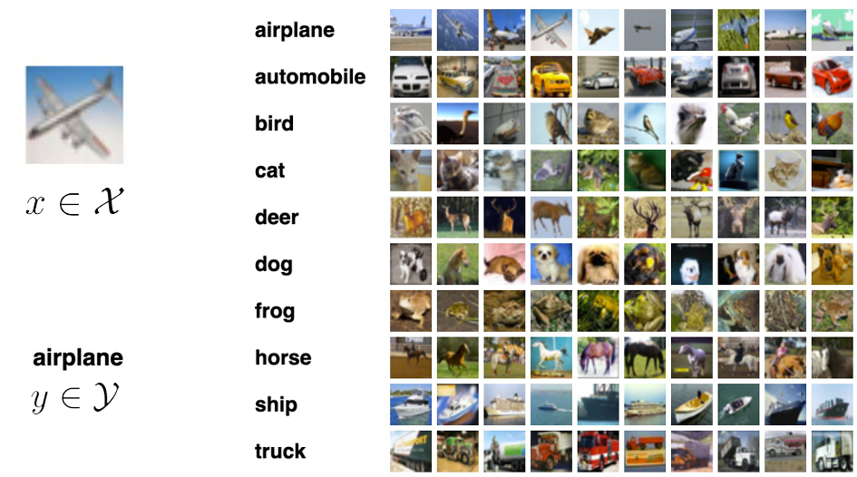

# 3주차 (1)

*Ref. LG AI Module 3 강의 및 강의 자료*

## Supervised Learning Overview

### 지도학습(Supervised Learning)의 기본적인 개념

- **컴퓨터에게 어떠한 문제를 풀도록 학습시키는 내용**

- 지도학습의 **카테고리**
    - 문제와 정답 쌍이 다양하게 제공되는 형태로 학습 진행
    - Immage Classification 이미지 분류 : 주어진 사진의 카테고리 분류
        
        
        
    - Text Classification : ex) 영화의 리뷰가 긍정적인지 부정적인지
        
        
        
    - Next Word Prediction 다음 단어 예측
    - Translation 번역
    - Price Prediction :  ex) 비트코인 혹은 주식에 대한 가격 예측
    
- 지도학습의 **수학적 정의**
    - Data : $x ∈ X$ usually a vector 어떤 데이터 입력 x, 대부분 다차원의 벡터
    - Label : $y ∈ Y$ x에 대응되는 정답 y, 이산형 집합에서 나오는 값일 수도 있고 실숫값일 수도 있음
    - Dataset : $(x^{(1)},y^{(1)}),(x^{(2)},y^{(2)}),...(x^{(n)},y^{(n)})$ 입력과 정답의 쌍들이 데이터로 여러개 존재하는 상황을 가정하고 이 데이터를 활용해서 학습
    
- **비지도학습과의 차이** : label(정답)의 존재

---

### Before Machine Learning

- **Rule-based Algorithms** (based on expertise, knowledge)
    - 전문가들이 일련의 규칙을 설명하는 방식으로 알고리즘을 하나하나 구현하려고 함
        
        ex) ‘0’을 판단하기 위해서는 전체적으로 곡선이 있어야 하며 가운데 갇힌 공간이 있어야 한다 등…
        
    - 한계 : 예외적인 조항 존재, 복잡해서 규칙을 일일이 설명할 수 없는 문제
    
- **머신러닝**
    - 다양한 입력과 그에 대응되는 레이블 (입력과 정답 쌍) 데이터 제공
    - 사람이 규칙을 입력하는 것이 아닌 알고리즘이 스스로 규칙을 파악해 판단하게 도와주는 학습 
    → Supervised Learning

---

### Unsupervised Learning

- 정답 쌍이 없이 데이터만 던져져 있어서 데이터로 무엇을 해야 하는지에 대한 지도나 감독이 없는 것
    - ex) 이미지를 100장을 주고 이미지로부터 유의미한 정보를 추출하라는 과제가 주어지는 경우
    - 클러스터링
        
        
        

---

### Supervised Learning

- Classification **분류**
    - 고를 수 있는 정답이 정해져 있고, 다음 정답이 무엇인지를 주어진 보기에서 맞히는 문제
    - ex) 이미지 분류, 텍스트 분류 등
    - 문장 번역, 다음 단어 예측 또한 분류 → 정답이 글자 조합으로 이루어져있고, 무한하지 않기 때문에 보기에서 정답을 고르는 경우에 해당한다고 분류
    
- Regression **회귀**
    - 정답이 숫자로 혹은 연속적인 실수 변수로 표현되는 경우
    - ex) 주가 예측, 키와 같은 연속적인 변수를 맞히는 문제
    
- **Setup**
    - 정답 함수  $f^*$ : 데이터 셋(n개의 데이터쌍)이 주어졌을 때 각 문제에 대응하는 정답을 정확하게 매핑할 수 있는 가상의 정답함수
        
        
        
    - 목표 : g(x)라고 하는 함수 혹은 모델을 정답함수에 최대한 가깝게 만드는 것
    - 함수 클래스 : 세상에 존재하는 모든 함수를 정의하는 것이 아닌, 함수 클래스를 정해서 그 중에서만 뽑음
        
        
        
    - 함수 클래스에 속해 있는 gθ  함수 중에서 정답 함수 $f^*$를 가장 잘 근사하는 함수를 찾는 문제

- **잘 근사한다는 것**이란?
    - 모든 입력 x에 대해서 내가 추정하고 싶은 함수 gθ와 정답함수가 비슷하다
    - 주어져 있는 데이터셋에 대해서 정답함수와 일치해야 한다
        
        
        
    
- **손실함수**
    - 내 모델이 예측한 결과와 정답함수가 예측한 정답이 얼마나 비슷한지 평가
    - Pointwise Loss : $(x^{(i)},y^{(i)})$라고 하는 하나의 데이터 포인트에 대해서 어떠한 손실이 발생하는지 계산
        
        
        
    - Loss : n개의 데이터에서 발생하는 Pointwise Loss를 총 더한 혹은 평균을 낸 결과
        
        
        
    - supervised Learning이란 L(θ)라고 하는 것을 가장 작게 만드는 gθ가 누군지를 맞히는 문제
    

---

### 선형회귀 문제 예시

몸무게, 키 중 하나가 주어져 있을 때 다른 하나를 맞히는 문제 가정

x축 : 키, y축: 몸무게

- 수많은 데이터 쌍 존재 : 선형적인 혹은 양의 상관관계를 가지는 데이터셋으로 각각의 데이터 포인트가 하나의 $(x^{(1)}, y^{(1)})$
    
    
    
    - x는 키에 해당하기 때문에 실숫값으로 1차원 벡터가 아닌 스칼라, y는 몸무게로 이또한 실수
    - θ라고 하는 파라미터로 인덱싱
    
- 선형함수를 찾는다 = 선형함수의 계수인 (a,b)를 찾는 문제로 치환 가능 → 클래스를 좁히는 것에 성공

- 손실함수 정의
    - 일반적으로 선형함수 문제에서는 Mean-Squared Error를 이용해서문제 해결
    
    
    
    → 내 모델의 예측값과 정답값 차이의 제곱을 비교하는 형태
    
    - 어플리케이션에 따라서 어떤 경우에는 L1 Distance, L1 Loss, 혹은 그 외에 수많은 다양한 손실함수들이 더 올바른 선택지인 경우도 존재할 수 있음
    
- Solve Linear Regression
    - Loss function
        
        
        
    - Simplified
        
        
        
    - a에 대해 미분해서 0이 되는 지점과 b에 대해 미분해서 0이 되는 지점 찾기
        
        
        
        → a와 b에 대한 일차식 두 개를 푸는 문제
        
    - L의 Gradient는 각각 a와 b로 미분한 것들을 모아놓은 벡터, 이 Gradient가 0이 되는 지점을 찾는 문제
        
        