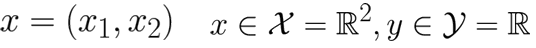

# 3주차 (2)

*Ref. LG AI Module 3 강의 및 강의 자료*

## Linear Regression

### 다차원 입력에 대한 선형회귀

- **2차원**의 경우
    
    
    
    - model class : x1과 x2를 선형 조합하는 선형 함수들의 클래스로 문제 한정 
    → 세 개의 순서쌍을 잘 찾는 문제로 치환해서 풀이 가능
        
        
        
    
    - Loss fuction (Mean-Squared Error Loss 사용)
        
        
        
    
    - 각각의 경우에 대해 내 모델의 추정값-정답 차이의 제곱을 데이터 포인트가 세 개인 경우로 국한
        
        
        
        → 아무리 많은 데이터 포인트가 있다고 하더라도 결국 정리하면 a1, a2, b에 대한 이차식을 얻을 수 있음
        
    
    - L(a1, a2, b)가 어떤 a1, a2, b일 때 가장 작아지는가
        
        
        
        → Gradient = 0을 푸는 문제 (Gradient : a1, a2, b에 대해서 미분한 것으로 이루어져 있는 벡터)
        
        
        
        
        

- **d차원**의 경우
    - data (입력 : d차원의 벡터, 대응하는 y는 실숫값)
        
        
        
    
    - Function Class
        
        
        
    
    - Loss functuin
        
        
        
    
    - 단순화하는 수학적인 테크닉 (두 개의 변수를 하나로 융합해서 하나의 변수 벡터를 만들어내는 테크닉)
        
        
        
        a를 정의하는 것이 선형함수의 정의이므로 θ=a
        
        
        
        → can solve linear equations with d+1 variables
        

---

### Normal Equation

- 선형회귀를 벡터 미분을 이용해 간단하게 풀 수 있는 테크닉

- 손실함수 전개식(= a에 대한 이차식)을 a에 대해 미분하면 Xa에 대한 이차식은 계수의 앞에 2가 붙는 일종의 스칼라 이차함수를 미분하는 것과 비슷한 효과 발생
    - a에 대한 미분 (a에 대한 Gradient 값)
        
        
        
    - 2를 없애서 문제를 풀어본다면
        
        
        

---

### 선형적이지 않은 데이터에 대한 경우

- 감소하다가 증가하는 데이터에 대해 이차함수로 표현하면 더 잘 표현할 수 있을 것이라고 생각
→ 그러나 이차회귀가 아닌 선형회귀의 일부로 바라봄

- **왜 이차함수를 사용하는데 선형회귀**인가?
    - x와 y를 구하는 것이 아닌 x와 y는 주어짐
    - x에 붙는 계수들이 무엇인지를 맞히는 문제로, 이 수식은 a에 대한 일차식이 유지됨

- **We fit parameter “a”**
    
    
    

- **다양한 형태의 추가함수를 넣어서 데이터를 더 완벽하게 설명**하고자 할 수 있음
    - 피처 혹은 커널들을 추가하는 형태로 더 표현력이 높은 함수 구현 가능
    - 너무 많은 피처 혹은 커널들을 추가하다보면 필연적으로 overfitting 문제에 봉착

---

### Overfitting: Bias-Variance Tradeoff

- 특정 데이터를 수정하는 경우
    - 일차식으로 표현한 경우엔 큰 틀이 바뀌지 않음
        
        
        
    - 고차식을 사용한 경우 모델이 크게 변함 → Overfitting 문제
        
        
        

- **More data is better**
    
    
    
    - Overfitting 문제를 해결하는 간단한 방법은 데이터를 많이 주는 것
    - 주어진 데이터 대비 모델이 너무 복잡하진 않은지 조심

- **Underfitting vs Overfitting**
    
    
    
    - Underfitting 과소적합 : bias 존재
    - Overfitting 과적합 : 변동성이 높음
    

---

### How can we recognize overfitting?

- 데이터는 대부분 고차원이기 때문에 **시각화가 어려움**
    - 학습 데이터를 학습데이터와 검증데이터로 나누어서 다루는 것 필요
    
- **Validation loss**와 **train loss**가 비슷하면 overfitting은 발생하지 않았다라는 결론 도달 가능
    - Validation Loss : 학습에 사용하지 않았던 데이터를 가지고 계산하는 손실
    - Train Loss : 학습에 사용한 데이터를 가지고 계산한 손실
    
- **일반화**
    
    
    
    - 학습데이터를 학습데이터와 검증데이터로 나눔
    - 학습하면서 학습데이터가 유의미하게 작아지는지 확인 
    → 유의미하게 작아지지 않는다면 Underfitting이 발생한 경우
    - 모델을 충분히 키워서 학습 손실이 꽤 작아지는 지점을 찾았을 때 과적합의 발생여부 판단
    - 학습 데이터셋에서 발생하는 손실과 검증 데이터셋에서 발생하는 손실의 차이가 크진 않은지 판단

- **Train-Validation-Test**
    - 테스트 데이터는 검증 데이터가 아닌 따로 저장되어있는 데이터를 사용해야 함
    - 학습셋과 검증셋을 이용해 overfitting이 발생하지 않으면서 underfitting은 넘어서는 것을 찾아낸 다음 최종적으로 마지막 테스트셋으로 실험해야 함
    
- **Rules**
    - Occan’s Razor : 어떠한 현상을 설명하는 가능한 가장 간단한 법칙을 따르자
        
        ⇒ 이차식과 삼차식이 둘다 유의미하다면 가급적 간단하면서 단순한 모델(이차식)을 사용하는 것이 낫다
        

---

### If you are in overfit

- **모델의 복잡도 낮추기**
- **데이터 얻기**
    - Cross Validation : 데이터가 부족한 경우 해결 방법
        
        
        
- **생성형 샘플** 사용 : 생성 모델의 성능에 의존할 수 있기 때문에 조심해야 함
- **정규화**
    - 과적합을 방지하기 위한 제약을 걸어주는 것
    - 정규화가 중요하지 않은 경우, overfitting이 모델을 심각하게 망가트리지 않는 경우 적절한 regularization 사용
- **증강**
    - 데이터를 많이 생성하는 방법
    - 일반적으로 이미지 혹은 데이터들은 어떤 특정한 변화에 대해 불변성을 가짐
    ex. 강아지 사진을 좌우 반전, 오른쪽 회전 등을 해도 강아지 사진이라는 사실은 변하지 않음
    - 불변성을 활용해서 더 많은 입력 이미지를 생성해 모델에 데이터를 줌