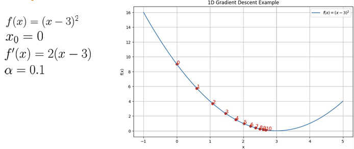

# 4주차 (1)

*Ref. LG AI Module 3 강의 및 강의 자료*

## Gradient Descent

### Gradient Descent

- **가정**
    - 함수의 Gradient 정보가 있다 (함수의 특정값에 대한 특정 위치에서의 미분값만 계산할 수 있다)
    - Global view가 없다 (전체적인 함수의 개형을 모른다)
    - 대부분의 가설이 우리가 일반적으로 받아들일 수 있는 가설이다
    
- **알고리즘**
    - 임의의 시작점을 정한다
    - 매 스텝마다 어디가 가장 가파르게 증가하고 감소하는 방향인가를 gradient가 계산
    - 미분값으로 이루어져있는 벡터는 결국 손실함수가 가장 빠르게 증가하는 방향을 나타냄
    
- **예시**
    
    
    
- **Learing rate** : 가장 가파르게 감소하는 방향으로 몇걸음을 걸을 것인가?
    - 일반적으로 선호하는 Gradient Descent 알고리즘은 계산을 적게할수록 좋은 것
    - Small learning rate (ex. $\alpha$ = 0.01)
        
        
        
        → 값에 도달하는 데 오랜 시간이 걸릴 수 있음
        
    - Large learning rate (ex. $\alpha$ = 1.05)
        
        
        
        → 값에 수렴하지 못하고 함숫값이 발산할 수 있음
        

- **2차원 Gradient Descent**
    
    
    
    
    
    - gradient를 계산하고 임의의 (x,y)를 집어넣으면 해당 위치에서 어느 방향으로 움직이는 것이 가장 작은지를 판별할 수 있는 상황에서 알고리즘 사용 가능
    - gradient descent 알고리즘이 gradient가 0인 지점으로 우리를 안내할 순 있지만 그 지점이 반드시 최솟값이라는 보장은 없다
    - 같은 함수에 대해서도 initialization이 바뀜에 따라서 수렴하는 지점이 드라마틱하게 달라질 수 있다

- **일반적으로 사용되는 방식**
    - 랜덤하게 initialization을 해서 여러 번 시도를 해본다
    - learning rate 조절
        
        
        | 손실값이 너무 천천히 감소할 때 | 손실값이 들쑥날쑥하거나 줄어들지 않을 때 |
        | --- | --- |
        | learning rate를 키운다 | learning rate를 줄인다 |

---

### 종류

- **Gradient Descent**
    
    
    
    - 전체 Gradient : gradient를 계산해서 평균을 낸 것
    - gradient를 이용해서 θ 파라미터 업데이터

- **S**tochastic **G**radient **D**escent
    - iteration에서 데이터를 한 개 뽑는 것
    - 전체 gradient 평균을 사용하는 것이 아닌 i번째 데이터 포인트에서 계산된 gradient를 대표로 사용
    - noise한 형태의 행동을 보일수 있다는 단점이 존재할 수 있지만 계산횟수를 훨씬 줄일 수 있는 방법
    
    
    

- **Mini-batch Gradient Descent**
    - 실제로 가장 많이 사용하는 알고리즘
    - 데이터를 b개 뽑는 것
    
    
    

- **Gradient Descent -** **Linear Regression**
    
    
    

---

### Gradient Descent: Drawbacks

- Can **stuck at the local minima**
    - 국소 최저치에 갇힐 수 있음
    - 국소로 최저치지만 전체적인 최저점과 차이가 굉장히 클 수 있음
    
- gradient가 굉장히 작아지는 지점에서는 동력을 잃고 멈추게 될 수도 있다

---

### Gradient Descent 알고리즘을 적용할 때의 여러 테크닉

- **Momentum SGD**
    
    
    
    
    
    - 관성 구현 → 순간적으로 평탄한 지대에 접어들더라도 관성을 가지고 돌파
    - 어떠한 궤적으로 걸어왔는지 판단 후 어디로 이동할지 결정
    - 베타값이 작을수록 현재값, 클수록 과거값에 의존
    - 1차원 모멘텀을 생각하는 형태
    
- **RMS Prop**
    
    
    
    - 방향들에 대해서 차별화
    - Gradient의 각 위치에서의 크기값에 따라서 정규화 해주는 형태로 진행
    - 2차원 모멘텀을 생각하는 형태
    
- **ADAM**
    
    
    
    - Momentum SGD와 RMS prop을 합친 형태의 기법으로 굉장히 많이 사용
    - 1차원 모멘텀, 2차원 모멘텀을 동시에 사용하고 Bias Correction이라고 하는 테크닉을 이용해서 약간의 편향 교정 → 일차 모멘텀 $\div$이차 모멘텀을 이용해서 현재 나아가야 하는 방향 결정
    
- **비교**
    
    
    | Momontum SGD | 모멘텀 축적 |
    | --- | --- |
    | RMS Prop | 각 방향에 대한 크기에 기반해서 Learning rate 조절 |
    | ADAM | 1차원 모멘텀과 2차원 모멘텀을 동시에 고려해서 Learniing rate 조정 후 결정 |
    

---

### Learning rate scheduling

- learning rate를 조절하는 다양한방법
    
    
    
    - 일정 Epoch 동안 너무 발전이 없으면 learning rate를 키우기
    - 일정 스텝마다 learning rate를 줄이기
    - learning rate를 exponential하게 deeping
    - 발전이 없으면 learning rate를 키우고 다와가는 거 같으면 learning rate를 줄이는 복합적인 방법