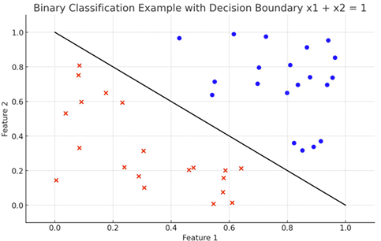

# 4주차 (2)

*Ref. LG AI Module 3 강의 및 강의 자료*

## Classification

### 선형 분류 - 이진분류 Binary Classification

- 카테고리가 두 가지만 주어져 있는 경우 (입력 x가 2차원인 경우의 예시)
    
    
    

- **Given dataset** (with label)
    
    
    
- Set **function class *g*** : 이러한 형태의 문제를 푸는 가장 좋은 함수를 어떤 집단에서 찾을 것인가
- Set **loss function** ℓ : 이 함수가 좋은지 안 좋은지를 어떤 식으로 판단할 것인가
- Linear Classifiers **선형 분류기**
    
    
    
    - x가 d차원에 존재하고 있을 때 $a^Tx+b$를 기준으로 0보다 크느냐 작느냐에 따라서 결정하게 되는 함수
    - Hyperplane : 위를 1, 아래를 Class Label -1에 해당하도록 분류하는 직선 경계선
- **0-1 Loss**
    
    
    
    - 분류를 데이터포인트에 대해서 할 때 정답을 맞혔는지 못 맞혔는지를 카운팅하는 함수
    - Loss값 : 각 포인트에서의 예측값과 정답 비교 → 일치시 Loss 값 0, 불일치 시 Loss 값 1
- **가정** : 선형적으로 분리가 가능하다
    - 정답을 100% 맞히는 분류기가 반드시 하나는 존재한다고 가정

---

### Perceptron Algorithm

- 데이터를 올바르게 분류하는 직선 분류기 알고리즘을 찾는 방법 중 하나
- **알고리즘**
    - 데이터가 존재할 때 임의로 직선을 그음
    - 잘못 분류되어 있는 점을 찾음
    - 이 점을 기준으로 a,b 값 업데이트
    - 이러한 과정(잘못 분류된 것 찾고 값 업데이트)을 여러 번 반복하다 보면 올바른 분류기로 수렴
    
- **장단점**
    
    
    | 장점 | 단점 |
    | --- | --- |
    | 단순한 규칙에 따라서 동작
    (Gradient나 복잡한 형태의 수식을 계산할 필요x) | 정답이 없다면 (선형적으로 분리 불가능)
    영원히 멈추지 않고 동작하게 됨 |
    | 정답이 존재한다면 반드시 특정 완벽한 분류 알고리즘으로 수렴
    (데이터를 올바르게 분류하는 선형 분류 알고리즘이 하나 이상 존재) | 알고리즘이 곧 수렴을 하는지 영원히 도는지
    구분할 방법이 없음 |

---

### Linear Programming

- 최적화
    - 최소화 혹은 최대화 하고 싶은 대상이 있음
    - 최소화 혹은 최대화를 하는 동안 만족해야 하는 어떤 조건이 존재
    
- 선형 분류 문제를 Linear Programming 문제로 치환해서 푼다는 것
    
    
    
    - 목표는 없지만 제약 조건만 있는 형태의 최적화 문제를 푸는 상황
    - 특별히 최적화에서는 조건이 선형이고 목표가 선형적인 문제를 Linear Programming 클래스로 분류
    
- 해결 알고리즘이 따로 존재함

- **장단점**
    
    
    | 장점 | 단점 |
    | --- | --- |
    | 정답이 없는 경우, 최적화가 실행 불가능하다고 알려줌 | 존재하는 정답 중에어떤 것을 주게 될지 정확히 알 수 없음 |

---

### What if we have many solutions?

- **Margin**
    
    
    
    - 모든 점으로부터 직선상의 거리를 했을 때 가장 짧은 거리 (수직거리 사용)
    - 두 개의 분류기가 존재할 때 margin이 큰 분류기가 더 견고한 것
    - 예시 : 파란점과 빨간점을 분류할 때 초록 점선과 검은 선 중 무엇이 옳은지?
        
        
        
        → 검은 선의 margin이 더 크기 때문에 검은 선을 골라야 함
        
    
- **Support Vector Machine (SVM)**
    
    
    
    - Margin을 극대화하는 분류기를 찾는 문제
    - a와 b에 대한 Scaling에 따라서 값이 유지
    - $a^Tx_0+b$를 1로 고정하고 ||a||가 제일 작아졌으면 좋겠다는 조건을 바꿔서 역으로 푸는 것
        
        
        
    - Convex Problem, QCQP 카테고리에 해당하므로 효율적으로 해결할 수 있는 알고리즘 존재
    

---

### What if we have no solutions?

- 데이터의 선형적 분리가 불가능해서 데이터를 올바르게 분류하는 직선이 존재하지 않는 경우
    - 예시
    
    
    

- **Soft-margin SVM**
    
    
    
    - allowing error : slack variable (penalty)
        
        → 모든 점이 만족할 수 없다면 각 점마다 $ζ_i$ 을 추가의 패널티로 사용해서 조금 넘는 것 허용
        
    - C값에 따라서 경계가 달라질 수 있다 
    → ζ값만큼 선을 넘어가는 데이터를 심각하게 받아들일 거라면 C값이 커지고, 선을 조금 넘더라도 괜찮다고 한다면 C값이 작아지면 됨

- **Hinge Loss**
    - C값에 따른 분류기의 차이
        
        
        
        | Larger C | Small C |
        | --- | --- |
        | 이상치가 그나마 적게 선을 넘어가도록 함 | 이상치가 선으로부터 더 멀어짐 |
        | 대부분의 데이터를 올바르게 표현하기엔 부적절할 수 있음 | 나머지 전체 데이터에 초점을 맞춤 |
        
    - Hinge Loss라고 하는 max(0,1-x)라는 함수를 이용하면 목표를 최소화하는 문제로 바꿀 수 있게 됨
        
        
        

---

### Kernel

- 경계선을 직선이 아니라 다른 함수를 이용해서 표현하고 싶다면?
    - 어떤 Quadratic한 Kernel들을 사용할 수 있음
    - 표현할 수 있는 함수의 Class가 더 커짐
        
        
        
    - 과적합이 발생할 수 있는 위험 존재