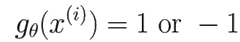
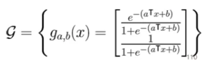

# 5주차 (1)

*Ref. LG AI Module 3 강의 및 강의 자료*

## Logistic Regression

### Soft Guess

- **Hard guess**
    
    
    
    - 반드시 정답을 둘 중의 하나 혹은 여러 개 클래스들 중 하나를 말해야 하는 상황
    - 예시 : 비가 온다 or 안 온다
    
- **Soft guess**
    
    
    
    - 정답 하나를 고르게 하기 보단 확률을 통해 결정하도록 하는 형태
    - 예시 : 비 올 확률 70% and 안 올 확률 30%

---

### Logistic Regression : Model Class

- 어떤 입력이 들어왔을 때 출력이 단순히 ‘클래스 -1’, ‘클래스 1’ 둘 중의 하나만 되는 것이 아니라 내 모델이 생각하는 -1일 확률과 +1일 확률, 숫자 두 개를 내뱉는 형태의 모델
- 로지스틱이라고 하는 함수를 활용하여 함수 클래스를 제한하면 이것을 ‘로직스틱 회귀’라고 부르게 됨
- 분류 문제를 회귀 문제로 바꾸어서 0과 1 혹은 1과 -1 중에 하나만 내뱉는 것을 연속형 확률을 내뱉을 수 있도록 함으로써 회귀 문제로 바꿔서 푼다고도 해석 가능

---

### Logistic Regression: Logistic Function

- 경계선 부분에서 soft한 결정을 허용하도록 하는 로지스틱 회귀 함수 사용
    
    
    

- $a^Tx+b$ 의 역할
    - 0보다 크거나 작은 정도에 따라서 신뢰도가 바뀌게 됨
        
        
        
        | 작은 음수 값 | 0 | 큰 양수 값 |
        | --- | --- | --- |
        | 클래스 1일 확률이 낮아짐
        -1일 확률이 매우 높아짐 | 경계선 상에 있기 때문에
        빨간색, 파란색인 경우가 5:5 | 클래스 1일 확률이 매우 높아짐 |

---

### Cross Entropy Loss

- 정답에 얼마나 높은 확률로 예측했냐에 따라 손실값이 다르게 나오게 하는 손실함수
    
    
    

- 예측된 값은 확률을 정답에 얼마나 배치를 잘했는가를 가지고 평가를 받을 수 있음
    - 비가 올 확률이 70%라고 예상했을 때 비가 온다면 loss = log1/0.7
    - 비가 올 확률이 30%라고 예상했을 때 비가 온다면 loss = log1/0.3

- **KL Divergence**(혹은 Relative Entropy) 식에서 유도됨
    - 두 개의 확률분포가 존재할 때 이 두개의 확률분포가 얼마나 멀리 떨어져 있는가를 계산하는 확률분포 사이의 거리를 측정하는 함수
        
        
        

---

### Logistic Regression

- **Dataset** (with binary label)
    
    $(x^{(1)},y^{(1)}),(x^{(2)},y^{(2)}),...(x^{(n)},y^{(n)})$
    

- **Function class** : 로지스틱한 함수들로 구성
    
    
    

- **Loss function** : Cross Entropy 이용
    
    
    
    - $x_0$= 1이라고 하는 더미 변수 하나 추가 → 단순히 $θ^Tx$ 라는 형태 이용
        
        
        
        
        
    
    - **단순화** 작업
        
        
        
        : Gradient Descent 알고리즘을 적용해서 올바른 θ 혹은 최적의 θ를 찾으면 됨
        
    
    - **h(z) 함수** 정의 : 손실함수가 로지스틱 손실 함수의 평균으로 표현됨
        
        
        
        → Hinge Loss와 식 형태가 유사하지만 미분 불가능한 부분이 부드럽게 바뀐 로지스틱 손실로 대체
        

---

### 다중 분류 (Multiclass Classification)

- **클래스가 여러개인 경우** 문제를 어떻게 풀 것인가
    - 이항 분류의 일반화로도 문제 해결 가능 → 이진 분류 문제를 여러 번 반복해서 푸는 형태
    - 여러 개의 확률을 내뱉도록 모델 디자인 가능 → 선형함수를 통과시키고 SOFTMAX라고 하는 함수를 통과시켜서 확률과 유사한 output을 내도록 설정
        
        
        
- **SOFTMAX 함수**
    - 로지스틱 함수의 일반화된 버전이라고 생각해도 무방
    - MAX 함수가 Hard하게 MAX를 찾는 것이 아니라 Soft하게 MAX를 찾는 값
    - SOFTMAX의 output은 다 더하면 1이 되고 각각이 양수임 → 확률분포로 해석 가능하게 만들어 줌

---

### Softmax Regression

- Softmax regression이 일종의 로지스틱 회귀를 포함하는 컨셉
    
    
    

- **Dataset** (with discrete label)
    
    $(x^{(1)},y^{(1)}),(x^{(2)},y^{(2)}),...(x^{(n)},y^{(n)})$
    

- **function class** : 입력 x를 선형으로 표현하는 hc → h값들을 exponent 취하고 정규화해서 얻은 결과가 softmax 함수 혹은 우리가 사용하는 함수 클래스의 최종 output
    
    
    
    
    
    - d : 입력 x에 대한 입력 차원
    - k : 클래스의 개수

- **loss function** : cross entropy loss 사용
    
    
    

---

### False Positive, False Negative

- 한계점
    - 코로일 확률 0.3, 아닐 확률 0.7인 경우 가정
    - 직관적으로 생각했을 때 코로나가 아닐 확률이 더 높음 → 무의식 중에 기준점(한계점)을 0.5로 잡은 것
    - 어플리케이션마다 적절한 한계점을 설정하는 것이 중요하다
    
- 한계점을 조정함에 따라  **Precesion-Recall** 두 개의 **가중치 교환**이 발생하게 됨
    
    
    
    |  | 높은 한계점 | 낮은 한계점 |
    | --- | --- | --- |
    | 음성인 사람을 양성으로 분류하는 경우 | 감소 | 증가 |
    | 양성인 사람을 음성으로 분류하는 경우 | 증가 | 감소 |
    - Precision : 양성 판정을 내린 사람 중에 진짜 양성이 누구였냐를 판단
    - Recall : 실제 양성 환자 중에 우리가 얼마나 양성 판정을 내렸냐
    
    → precision과 recall 중 무엇을 더 중요하게 여기는 어플리케이션인지에 따라 한계점을 적절히 설정
    
- **F1-score**
    - precision과 recall의 harmonic mean인 f1-score를 많이 사용하기도 함
    
- **ROC Curve**
    
    
    
    - **T**rue **P**ositive **R**ate : 실제 positive 중 true positive를 얼마나 많이 선언했는가 → TP/(TP+FN)
    - **F**alse **P**ositive **R**ate : 실제 negative 중 false positive를 얼마나 많이 선언했는가 → FP(FP+TN)
    - Always say positive : FN=TN=0, TPR=FPR=1
    - Always say negative : TP=FP=0, TPR=FPR=0
    - Random Guess : No difference between TPR, FPR
    - ROC Curve 혹은 밑에 면적을 어떤 지표로 사용하는경우도 많이 있음 → ROC Curve 아래 면적이 넓으면 넓을수록 (perfect classifier에 최대한 가까울수록) 더 좋은 분류 알고리즘이다