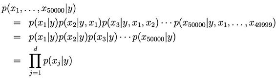

# 5주차 (2)

*Ref. LG AI Module 3 강의 및 강의 자료*

## More On Supervised Learning Beyond

### Naive Bayes: Spam Filter

- **나이브 베이즈 가정**
    - x의 벡터들이 어떤 y가 주어졌을 때 독립이다 → 각 확률의 곱으로 표현할 수 있음
        
        
        
    - ex) y가 스팸메일이라고 주어졌다면 각 단어가 등장하거나 등장하지 않을 확률이 전부 독립이다
    
- **확률 추정** (확률 : 스팸일 때 이 단어가 등장하는 빈도)
    
    
    
    
    
    - 스팸메일일 때, 아닐 때의 j번째 단어의 빈도를 계산하고 스팸 메일의 비율 계산
    - 최종적으로 확률의 역산을 베이즈 정리를 이용해서 진행
    - x라는 입력이 들어왔을 때 이 이메일이 스팸 메일일지 아닐지 확률을 베이즈 정리를 이용해 계산 가능
    
- **장점**
    - 조건부 독립이라고 하는 가정이 현실과 맞지 않을 수 있지만 그럼에도 불구하고 합리적으로 작동한다
    - 결과가 해석 가능하다 (어떤 단어가 스팸을 결정하는 중요한 인자인지 모아서 모델 해석에 사용 가능)
    
- **Naive Bayes: Laplace Smoothing**
    - 발생 가능한 문제 : 한 번도 등장하지 않았던 단어가 나왔을 때 어떻게 판단할 것인가?
    - 어떤 메일에서도 단어를 한 번도 못 봤을 때의 확률 = 0
        
        
        
    
    - 모든 단어가 이미 한 번씩 등장했다는 것을 가정하고 사용 시 0이 발생하는 일이 없어짐
        
        
        
        → 문제 없이 나이브베이즈를 이용 가능
        

---

### 의사결정나무 (Decision Tree)

- **순서도** 같은 느낌으로 여러 번 분류 : 단순하지만 효과적인 분류기법
    - 중간 노드 : 결정을 의미
    - branch : 해당 결정에서 어떤 결론을 내렸는가를 판단해서 어느 가지를 탈 것인가를 반복적으로 결정
    - leaf node : leaf node에 배정된 class label이나 값을 예측 문제에 적용

- **Decision Tree : Classification**
    - 예시 : 동물이 표유류인지 아닌지 판단하는 형태의 decision tree
        
        
        
    - 장점 : 전문 지식을 사용해서 나무 구현 가능, tree를 반복적으로 여러 개 사용해서 효과적인 형태의 분류기를 나타낼 수 있음
    - 단점 : 너무 단순한 질문만으로 분류

- **Decision Tree : Regression**
    - 예시 : 어떤 집의 가격을 방의 개수와 면적으로 평가하는 형태의 알고리즘 작성
        
        
        

- **장단점**
    
    
    | 장점 | 단점 |
    | --- | --- |
    | 해석 가능한 변수들을 이용해서 모델을 해석할 수 있음 | 스스로 학습하는 능력이 떨어지기 때문에
    복잡한 과제에서는 성능이 떨어질 수 있음 |
    
- **효율적인 의사결정나무** 만드는 법
    - 가지를 효과적으로 나눠야 함 → 사람들을 최대한 반반 가를 수 있는 효과적인 형태의 질문
    - 분류 : 질문을 했을 때 분할이 얼마나 균일하게 분산이 발생하는지를 엔트로피와 같은 방법으로 측정 가능
    - 회귀 : 각 leaf마다 분산이 적어서 추정치 오차가 적도록 하는 형태의 분할 기준 선택

- **Bagging**
    
    
    
    - tree를 여러개 활용해서 종합적으로 앙상블 모델 기법을 이용 → 평가를 종합해서 최종적으로 선택
    - 특정 질문에 치우치거나 특정 데이터에 과적합하지 않고 분산을 줄일 수 있는 기법
    
    - **Random Forest** 알고리즘
        
        
        
        - 여러개의 의사결정나무 사용 → 트리를 각각 독립적으로 학습
        - 몇몇 나무들이 비정상적인 판단을 내려도 대다수의 나무가 올바른 결정을 내린다면 성능이 올라감

- **Adaptive Boosting** (AdaBoost)
    - 앙상블 메소드 상용
    - 여러개의 모델을 순차적으로 학습
    - 첫 번째 모델을 학습해서 테스트 했을 때 오차가 큰 애들한테 더 높은 가중치를 줘서 그다음 학습할 때는 걔네를 위주로 학습이 발생하도록 함 → 모델이 스스로 학습하며 모델 성능이 점점 좋아짐

- **Bagging vs Boosting**
    
    
    | Bagging | Boosting |
    | --- | --- |
    | 여러 개의 모델을 평행하게 학습 | 여러 개의 모델을 순차적으로 학습
    → 틀린 것에 대해 강화하는 가중치 부여 |
    | 분산을 줄임 | Bias를 줄임 |
    | Aggregation
    - voting (classification)
    - Averaging (regression) | Aggregation
    - Weighted majority voting
    - Weighted Averaging |

---

### Supervised Learning Examples

- Super Resolution **초해상도**
    
    
    
    - 저해상도의 이미지를 고해상도로 변환
    - 데이터 : (저해상도 이미지,고해상도 이미지)
    - 모델 : 딥러닝 (CNN or Vision Transformer 부류의 모델)
    - Loss : pixel-wise MSE or PSNR
    
- Object detection **객체 인식**
    
    
    
    - Data : (image, box and label)
    - Model: 딥러닝 (CNN or Vision Transformer 부류의 모델)
    - Loss: difference (box coordinate) + classfication loss(혹은 cross entropy loss)
    
- **BERT**
    - 현재 LLM들의 시초가 된 트랜스포머 기반의 모델로 볼 수 있음
    
    
    
    - Data: (Masked sentence, tokenized sentence)
    - Model: Transformer (LLM)
    - Loss: Classification Loss
    
    
    
    - Data: (pair of sentence, binary (whether they are consecutive))
    - Model: Transfomer (LLM)
    - Loss: Classification Loss

- Anomaly Detection **이상치 탐지**
    - 정상 상황인지 곧 문제가 발생하는 이상 상황인지에 대한 데이터를 기존의 레코드로부터 수집했다고 할 때, 특정 딥러닝 모델을 활용해 학습시켜 나중에 비슷한 상황이 발생했을 때 이상 상황이니까 대비를 해야 한다는 것을 학습
    - Data: (sensory inputs, anomaly indicator)
    - Model: Deep Learning Models
    - Loss: (weighted) Classification Loss

---

### Beyond Supervised Learning

- **Semi-Supervised Learning**
    
    
    
    - Labeling is expensive
    - unlabeled data로부터 이미지의 기본적인 특성을 배우고 추출된 특성으로부터 label 데이터로 분류하는 기법을 배움
    - 증강기법 사용
        
        
        

- Generative Model **생성형 모델**
    - 대표적인 비지도학습
    - label이 없고 x만 주어짐
    - **G**enerative **A**dversarial **N**etworks 기법
        
        
        
    - **Diffusion 모델**
        
        
        
        - 정방향 프로세스 : 이미지에 노이즈를 추가해서 노이즈화시키는 과정
        - 역방향 프로세스 : 노이즈로부터 다시 원래 이미지를 복원해내는 (디노이징) 과정
        - 원리
            
            처음에는 label이 없는 데이터가 주어지며, 이 이미지에 노이즈를 더함
            (노이즈를 뺐을 때 어떤 이미지가 나오는지 일종의 정답을 아는 상태)
                                                        ↓
            한 단계 디노이징 하면 어떤 이미지가 나와야 되는지 모델 학습
                                                        ↓
            최종적으로 임의의 노이즈로부터 이미지 생성 가능